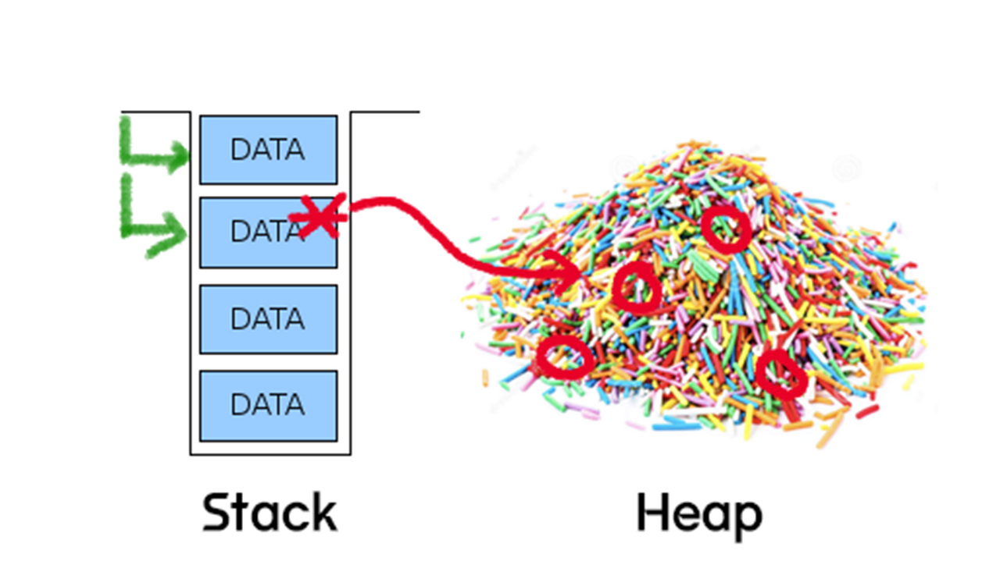

# 백엔드...?

## 목차

[C/C++/C#](#C/C++/C#)

[메모리 모델](#메모리-모델)

[힙-스택 메모리영역](#힙-스택-메모리영역)

[포인터?](#포인터?)

[동적 할당?](#동적-할당?)

---

## C/C++/C#

### C

- 절차지향 프로그래밍 언어
- 메모리 관리 직접 수행 -> 포인터 (할당/ 해제)

### C++

- 객체지향 프로그래밍 언어
- 메모리 관리 직접 수행 -> 스마트포인터

### C#

- .NET 프레임워크를 위한 언어
- 메모리 관리 -> 가비지 컬렉션

## 메모리 모델

프로그램 실행! ← 로드 ← 메모리 필요

- Stack : 지역, 매개 변수
  - 함수의 호출과 관계되는 지역, 매개변수 저장되는 영역
  - 호출과 함께 할당 → 완료되면 소멸
  - Push ← 데이터 저장, pop ← 데이터 인출
  - 높은 주소에서 낮은 주소로 할당
- Heap: 사용자 동적 할당, 런타임 크기
  - 사용자가 직접 관리
  - 동적 할당, 낮은 주소 → 높은 주소 할당
- Data: 전역, 정적
  - 전역과 정적 변수가 저장되는 영역
- Code: 코드
  - 메모리의 코드 영역은 코드가 저장되는 텍스트 영역

## 힙-스택 메모리영역

C++은 사용자가 직접 관리해야 함

### 1. Stack

- 스택 메모리는 함수 호출과 함께 자동으로 관리되는 로컬 변수를 저장하는 데 사용
- 단위: 프레임
- LIFO(메모리 쌓을 때는 그냥 올리고 해제할 때는 위에꺼부터 해제)
- 스택은 상대적으로 관리하기 쉽고, 빠른 할당과 해제가 가능하지만, 크기가 고정되어 있어 큰 데이터를 저장하기에는 적합하지 않음

### 2. Heap

- 힙 메모리는 프로그래머가 수동으로 할당하고 해제해야 하는 메모리 영역

### 2-1. 왜 Heap을 사용하는가?

1. Life cycle

- 스택은 쌓고 해체하는 방식 → 함수 단위로 쌓이고 사라짐(지역변수, 매개변수) → 반환값을 저장하지 않는 이상 사라짐

- 이를 해결하기 위해 다른 곳에 메모리를 할당하고 그 주소값 포인터를 스택에 저장

2. Large size

- 스택 메모리의 한계 때문 → 스택의 포인터만 할당 → 해당 주소 힙 메모리 공간에 object를 만든 후, 포인터를 통해 접근

3. Dynamic(runtime size) 문제

- 미리 알 수 없는 정보들을 동적 할당하기 위해서 힙을 사용함

## 포인터?

### 포인터

- 메모리의 주소값을 저장하는 변수

### 스마트 포인터

**정의**

- C++에서 사용
- 포인터처럼 동작하는 클래스 템플릿으로, 사용이 끝난 메모리를 자동으로 해제

**동작**

- New 키워드를 통해 기본 포인터가 메모리를 가리키도록 초기화 한 후, 기본 포인터 → 스마트포인터로 대입해 사용

**종류**

1. unique_ptr

   하나의 스마트 포인터만이 특정 객체를 소유

2. shared_ptr

   특정 객체를 참조하는 스마트포인터가 총 몇개인지를 참조하는 스마트 포인터

3. weak_ptr

   순환 참조를 제거하기 위해 사용됨

## 동적 할당?

### 정적할당

실행하는 순간 프로그램이 사용할 메모리의 크기를 고려하여 메모리를 할당

### 동적 할당

- 상황에 따라 원하는 크기 만큼 메모리 할당, 조정 가능
- 명시적으로 메모리 해제해야 함

### 방법

- C/C++ → malloc
- 자바, python → new
- Free, delete → C/C++ 에서 해당 메모리를 해제해야 함

## 자바 VS C++

1. 메모리 관리

- 가비지 콜렉터 vs 직접 메모리 할당

2. 성능

- 하드웨어에 더 가까움 , 메모리 관리, 최적화

- JVM JIT → 상당한 성능

3. 문법의 특징

- 순수 객체 지향 언어 모든 것을객체로 다룸

- C++은 객체 지향이지만,절차 프로그램이도 지원 → 템플릿 메타프로그래밍

## 문제

1. 메모리영역에서 heap과 stack에 대해서 설명하시오.

2. C/C++, java, python이 메모리를 어떻게 관리하는 지 설명하시오

## Reference
[순수객체지향언어?](https://velog.io/@bernard/%EC%9E%90%EB%B0%94%EB%8A%94-%EC%88%9C%EC%88%98%ED%95%9C-%EA%B0%9D%EC%B2%B4%EC%A7%80%ED%96%A5-%EC%96%B8%EC%96%B4%EC%9D%BC%EA%B9%8C-mpz8izem)
