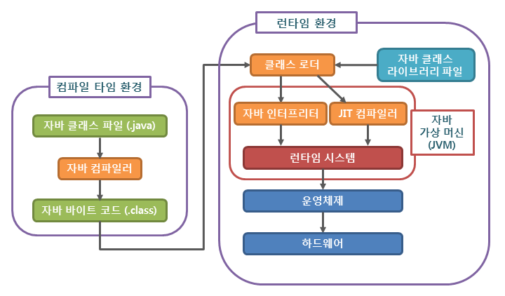
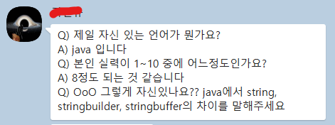
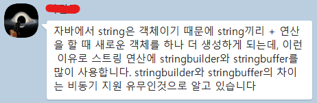

# 신입 개발자 기술면접 질문 정리 - 자바

## ✨Java의 특징을 설명해주세요

- Java는 객체지향 프로그래밍 언어입니다.
- 기본 자료형을 제외한 모든 요소들이 객체로 표현되고, **객체 지향 개념**의 특징인 캡슐화, 상속, 다형성이 잘 적용된 언어입니다.

### 장점

- **JVM(자바가상머신)** 위에서 동작하기 때문에 운영체제에 독립적이다.
- **GabageCollector**를 통한 자동적인 메모리 관리가 가능하다.

### 단점

- JVM 위에서 동작하기 때문에 실행 속도가 상대적으로 느리다.
- 다중 상속이나 타입에 엄격하며, 제약이 많다.

## ✨ JVM의 역할에 대해서 설명해주세요.

- JVM은 스택 기반으로 동작하며, Java Byte Code를 OS에 맞게 해석 해주는 역할을 하고 **가비지컬렉션**을 통해 자동적인 **메모리 관리**를 해줍니다.

## ✨ 가비지 컬렉션(Garbage Collection)에 대해 설명해주세요.

- 가비지 컬렉션은 프로그래머가 동적으로 할당한 메모리 영역 중 더 이상 쓰이지 않는 가비지 영역을 찾아서 해제하는 기능을 의미합니다.

## ✨ 가비지 컬렉션 과정에 대해 설명해주세요.

- GC의 작업을 수행하기 위해 JVM이 어플리케이션의 실행을 잠시 멈추고, GC를 실행하는 쓰레드를 제외한 모든 쓰레드들의 작업을 중단 후 (Stop The World 과정) 사용하지 않는 메모리를 제거(Mark and Sweep 과정)하고 작업이 재개됩니다.
- [깊은 학습](https://mangkyu.tistory.com/118) 이 필요할 것 같다. 중요한듯.

## ✨ Java의 컴파일 과정에 대해 설명해주세요.

- 개발자가 .java파일을 생성하고, build를 합니다.
- java compiler의 javac 명령어를 통해, 바이트코드(.class)를 생성합니다.
- Class Loader를 통해 JVM 메모리 내로 로드합니다.
- 실행엔진을 통해 컴퓨터가 읽을 수 있는 기계어로 해석됩니다. (각 운영체제에 맞는 기계어)
    
    
    

## ✨ 객체지향 프로그래밍(OOP)에 대해 설명해주세요.

- 우리가 실생활에서 쓰는 모든 것을 객체라고 합니다.
- 객체 지향 프로그래밍은, 프로그램을 객체들의 집합으로 모델링하는 방법론입니다.
- 특징으로는 캡슐화, 상속, 다형성, 추상화가 있으며 묘듈 재사용으로 확장 및 유지보수가 용이합니다.

## ✨ SOLID(객체지향 5대원칙)에 대해서 설명해주세요

- **SRP - 단일 책임 원칙** : 한 클래스는 하나의 책임만 가져야 합니다.
- **OCP - 개방-폐쇄 원칙** : 확장에는 열려있고, 수정에는 닫혀있어야 합니다.
- **LSP - 리스코프 치환 원칙** : 하위 타입은 항상 상위 타입을 대체 할 수 있어야 합니다.
- **ISP - 인터페이스 분리 원칙** : 인터페이스 내에 메소드는 최소한이여야 합니다.
    - 하나의 일반적인 인터페이스보다 여러 개의 구체적인 인터페이스가 낫다.
    - 특정 클라이언트를 위한 인터페이스 여러개 > 비대한 인터페이스
- **DIP - 의존관계 역전 원칙** : 구체적인 클래스보다 상위 클래스, 인터페이스, 추상클래스와 같이 변하지 않을 가능성이 높은 클래스와 관계를 맺어라.
    - DIP 원칙을 따르는 가장 인기 있는 방법은 의존성 주입(DI)이다.

[자세한 이해](https://dev-coco.tistory.com/142)

## ✨ 불변 객체가 무엇인지 설명하고, 대표적인 Java의 예시를 설명해주세요.

- 불변 객체는 객체 생성 이후 내부의 상태가 변하지 않는 객체를 말합니다.
- Java에서는 필드가 원시 타입인 경우 final 키워드를 사용해 불변 객체를 만들 수 있고, 참조 타입의 경우 추가적인 작업이 필요합니다.

## ✨ 원시타입과 참조타입의 차이에 대해 설명해주세요.

- 원시타입은 Java에서 단 8개 밖에 존재하지 않는 타입입니다. 나머지는 모두 참조타입이라고 볼 수 있고, Object 클래스이거나 이를 상속하는 클래스들로 이루어져 있습니다.
- 원시타입은 항상 값이 존재해야 합니다. 반면, Object 타입은 null 포인터를 가질 수 있습니다. 그리고 멤버변수가 초기화될 때, 원시타입은 기본값을 가지지만, 참조타입은 null 포인터를 가지는 차이도 있습니다.
- 원시 타입 표
    
    
    | 종류 | 데이터형 | 크기(byte / bit) | 표현 범위 |
    | --- | --- | --- | --- |
    | 논리형 | boolean | 1 / 8 | true 또는 false |
    | 문자형 | char | 2 / 16 | '\u0000' ~ 'uFFFF' (16비트 유니코드 문자 데이터) |
    | 정수형 | byte | 1 / 8 | -128 ~ 127 |
    | 정수형 | short | 2 / 16 | -32768 ~ 32767 |
    | 정수형 | int | 4 / 32 | -2147483648 ~ 2147483647( -21억 ~ + 21억) |
    | 정수형 | long | 8 / 64 | -9223372036854775808 ~ 9223372036854775807(-100경 ~ + 100경) |
    | 실수형 | float | 4 / 32 | 1.4E-45 ~ 3.4028235E38 |
    | 실수형 | double | 8 / 64 | 4.9E-324 ~ 1.7976931348623157E308 |

> `참조 타입`은 **원시 타입을 제외한 타입들(문자열, 배열, 열거, 클래스, 인터페이스)**을 말합니다.
> 

## ✨ 스프링 디자인 패턴 중, 아시는 걸 설명해주세요. (싱글톤)

- [깊은 학습](https://blog.naver.com/hj_kim97/222295968816)이 필요할 것 같다. (프록시, 싱글톤, 템플릿 메소드 …)
- 싱글톤 패턴은 클래스의 인스턴스가 오직 하나만 생성되도록 보장하는 디자인 패턴입니다.
- 이 패턴은 전역 변수를 사용하지 않고도 객체에 전역적으로 접근할 수 있게 합니다.

## ✨ 오버라이딩(Overriding)과 오버로딩(Overloading)에 대해 설명해주세요.

- 오버라이딩(Overriding)은 상위 클래스에 있는 메소드를 **하위 클래스에서 재정의** 하는 것을 말하고,
- 오버로딩(Overloading)은 매개변수의 개수나 타입을 다르게 하여 **같은 이름의 메소드를 여러 개 정의**하는 것을 말합니다.

## ✨ String, Stringbuilder, Stringbuffer의 차이를 설명해주세요.

- String은 **불변의 속성**을 가지며, StringBuffer와 StringBuilder는 **가변의 속성**을 가집니다.
- StringBuffer는 동기화를 지원하여 멀티 쓰레드 환경에서 주로 사용하며,
- StringBuilder는 동기화를 지원하지 않아 싱글 쓰레드 환경에서 주로 사용합니다.
    - 이로인해 StringBuffer보다 빠름.
- [자세한 이해](https://dev-coco.tistory.com/25)

> 비동기(async)는 동시에 여러 작업을 수행할 수 있는 개념이며, 동기화(synchronization)는 서로 다른 개념이라고 합니다.
> 

## ✨ Synchronized에 대해 아는 대로 말해주세요.

- 멀티스레딩 환경에서 공유 자원에 대한 동시 접근을 제어하기 위해 사용되는 개념입니다.
- 하나의 스레드가 특정 메소드나 코드 블록을 실행하는 동안 다른 스레드가 동시에 접근하는 것을 막습니다.
- 이를 통해 데이터의 일관성과 무결성을 유지할 수 있습니다.
- [자세한 이해](https://velog.io/@backtony/Java-synchronized-%EB%8F%99%EA%B8%B0%ED%99%94)

## ✨ 프로젝트에서 자바 n을 사용하셨는데, 선택하신 이유가 있을까요?

- 프로젝트와 연관지어서 한 번 생각해보길 권합니다.
- java 8, 11, 17에 대한 이해와 경험정리 한 번 하면 좋을 것 같아요

 

https://github.com/ksundong/backend-interview-question

https://dev-coco.tistory.com/153