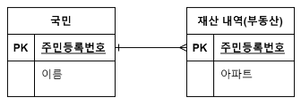
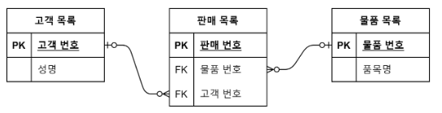
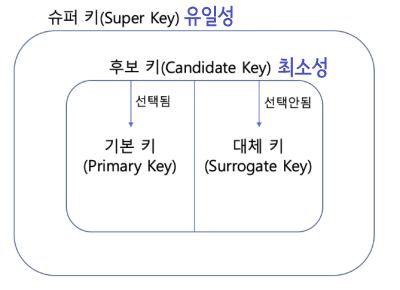
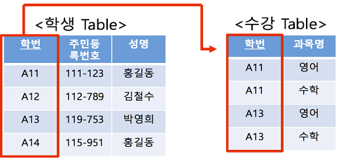
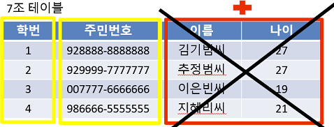

> :bulb: <b> 데이터베이스 </b>
>
> 일정한 규칙을 통해 구조화되어 저장되는 `데이터의 모음`

> :bulb: <b> DBMS (DataBase Management System) </b>
>
> - 데이터베이스를 제어, 관리하는 통합 시스템
> - DBMS마다 정의된 쿼리 언어를 통해 데이터 삽입, 삭제, 수정, 조회 등 수행 가능

 

# :open_file_folder: 구성 요소

## 엔터티 (Entity)

- 사람, 장소, 물건 등 여러개의 속성을 지닌 명사
- 데이터베이스에 입력될 데이터 집합을 의미
- ex) `회원 엔터티` - 이름, 아이디, 주소, 전화번호 .. 속성 有
- 약한 엔터티, 강한 엔터티
  - A, B가 존재할 때 A가 혼자서는 존재하지 못하고 B의 존재 여부에 따라 종속적이면 `A는 약한 엔터티`이고 `B는 강한 엔터티`
  - ex) 방, 건물 엔터티가 존재할 때 방은 `약한 엔터티`, 건물은 `강한 엔터티`

## 릴레이션 (Relation)

- 데이터베이스에서 정보를 구분하여 저장하는 기본 단위, 엔터티에 관한 데이터를 릴레이션 하나에 담아서 관리
- RDBMS 에서는 `테이블` NoSQL 에서는 `컬렉션`
- 스키마 (Schema)
  - 개념 스키마
  - 외부 스키마
  - 내부 스키마

## 속성 (Attribute)

- 릴레이션에서 관리하는 구체적이고 고유한 이름을 갖는 정보

## 도메인 (Domain)

- 릴레이션에 포함된 각각의 속성들이 가질 수 있는 값의 집합
- ex) `성별` 속성 - `{남자, 여자}` 도메인

## 관계 (Relationship)

- 데이터베이스에서 두 개의 엔터티 간의 관계

### 1:1 관계

- 테이블을 두 개의 테이블로 나눠 구조를 더 이해하기 쉽게 만듬
- 국민 한명은 하나의 여권을 가짐
- 하나의 테이블로 표현하는 경우도 많음

### 1:N 관계

- 한 개체가 다른 많은 개체를 포함하는 관계
- 국민 한명은 여러 채의 아파트를 가질 수 있음
- 여기서 1은 `국민` N은 `재산 내역`

### N:M 관계

- 한명의 고객은 여러개의 물품을, 한개의 물품은 여러명의 고객을 가질 수 있음
- 위와 같은 구조는 데이터베이스 설계 상 존재하지 않으며, 객체 관계에서 표현한다 하더라도 한계점이 존재
- 교차 엔터티 (판매 목록)를 만들어 N:M 관계를 1:N 관계로 풀어줌

## 키 (Key)

- 테이블 간의 관계를 조금 더 명확하게 하고 인덱스를 위해 설정된 장치
- 유일성

  - 하나의 키값으로 튜플을 유일하게 식별할 수 있음
  - 중복되는 값이 없음

- 최소성
  - 키를 구성하는 속성들 중 반드시 필요한 속성들로만 키를 구성
  - 굳이 없어도 될 속성을 넣지 말자는 것

### 기본키 (Primary Key)

- 유일성과 최소성을 만족하는 키
- 줄여서 PK라고도 부름
- 자연키 또는 인조키 중 골라 설정
  - 자연키 : 중복된 값들을 제외하고 남은 것을 `자연스레` 뽑다가 나오는 키
    - 언젠가는 변하는 속성
    - `회원` 테이블에 주민번호, 이름, 성별이 있을 때 --> 이름, 성별 제외한 `주민번호`가 자연키
  - 인조키 : `인위적으로 생성`한 키
    - 자연키와 달리, 변하지 않음 --> 보통 <b>기본키를 인조키</b>로 설정

### 외래키 (Foreign Key)

- 다른 테이블의 기본키를 그대로 참조하는 값
- 개체와의 관계를 식별하는데 사용
- 줄여서 FK라고도 함
- 중복되어도 상관 없음

### 후보키 (Candidate Key)

- 기본키가 될 수 있는 후보들
- 유일성과 최소성을 동시에 만족
- 노란 박스가 후보키들

  

### 대체키 (Alternate Key)

- 후보키가 두개 이상일 경우, 어느 하나를 기본키로 지정하고 남은 후보 키들을 말함
- 아래에선 학번이 기본키이고, 주민번호가 대체키
  - 학번이 없어지게 되면 주민번호가 기본키 대체

### 슈퍼키 (Super Key)

- 각 레코드를 유일하게 식별할 수 있는 유일성을 갖춘 키
- 최소성은 만족하지 않음

 

# :question: 예상 질문

- 유일성과 최소성의 차이를 설명해주세요.
- 키에 대해 아는대로 설명해주세요.
- 관계에 대해 예시를 들어 설명해주세요.

 

# :newspaper: Reference

[데이터베이스의 관계](https://seahahn.tistory.com/89)
 
[N:M 테이블 관계 설계하기](https://escapefromcoding.tistory.com/402)
 
[키의 종류](https://velog.io/@00yubin00/DB-%ED%82%A4%EC%9D%98-%EC%A2%85%EB%A5%98-%EC%8A%88%ED%8D%BC%ED%82%A4-%ED%9B%84%EB%B3%B4%ED%82%A4-%EA%B8%B0%EB%B3%B8%ED%82%A4-%EB%8C%80%EC%B2%B4%ED%82%A4-%EC%99%B8%EB%9E%98%ED%82%A4)
