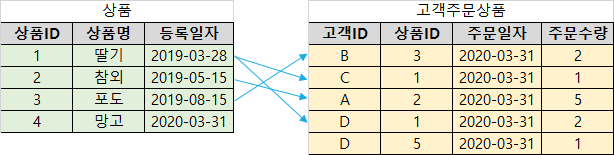
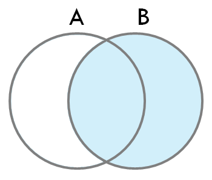
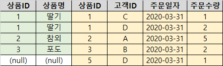
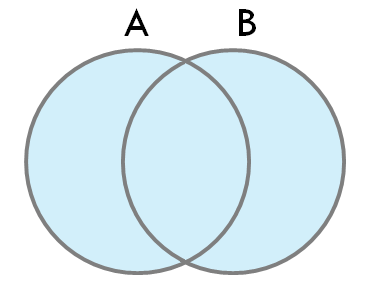
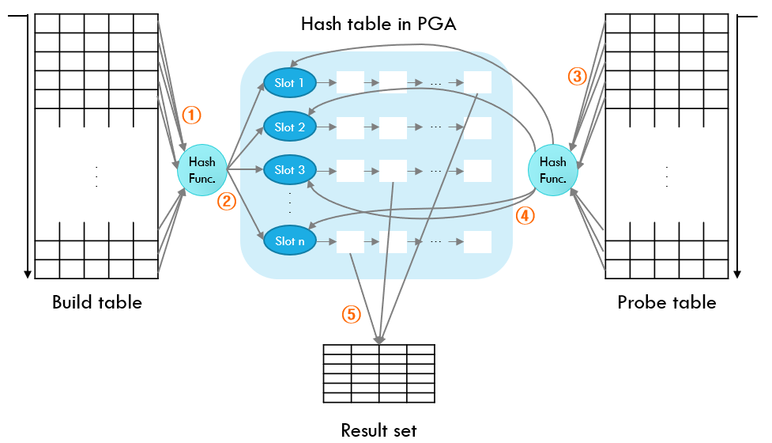
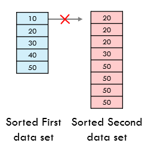
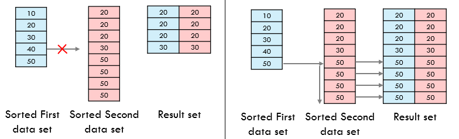

# Join

## Join이란?

> 2개 이상의 테이블을 결합하는 과정

## 왜 쓰나?

> 정규화를 진행하면 서로 관계있는 데이터가 여러 개의 테이블에 분산 저장되므로 효율적인 데이터 검색을 위해 조인이 필요하다

## 조인 종류

> **한쪽 테이블에만 존재하는 행의 출력 여부**를 기준으로!

### 예시 테이블

### Inner Join

> 서로 겹치는 데이터만!

 

-   조인 키 값에 따라 양쪽 테이블에서 공통적인 데이터만 반환

### Left Outer Join

> 서로 겹치는 데이터 + 남는 나머지 왼쪽 테이블 데이터도

 

-   Inner Join 데이터
-   나머지 왼쪽 테이블의 데이터도 오른쪽 데이터 속성은 null로 표시하여 반환

### Right Outer Join

> 서로 겹치는 데이터 + 남는 나머지 오른쪽 테이블 데이터도

 

-   Inner Join 데이터
-   나머지 오른쪽 데이터도 왼쪽 데이터 속성은 null로 표시하여 반환

### Full Outer Join

> 서로 겹치는 데이터 + 남는 양쪽 테이블 데이터도

 

-   Inner Join 데이터
-   나머지 모든 데이터도 각자 반대 테이블의 속성은 null로 표시하여 반환

## 조인 방식

> **각 row 매핑시의 메커니즘 종류**를 기준으로!

-   Oracle 기준이에요 ┗|｀ O′|┛

### NL(Nested Loop) Join

> 계속 **반복**해서 조인 작업 수행

-   driving table의 한 행과 매칭되는 driven-to table의 행을 찾기 위해서 driven-to table의 모든 데이터를 탐색하는 과정을 반복
    -   driving table : 조인 테이블 중 먼저 액세스하는 테이블
    -   driven-to table : 조인 테이블 중 나중에 액세스하는 테이블

 

-   NL 조인의 성능을 높이기 위해서는?
    -   조인 테이블 중 추출 건수가 **적은** 테이블을 driving 테이블로 -> 추출 건수가 곧 drivet-to table의 액세스 반복 횟수가 되기 때문
    -   driven-to table이 조인 컬럼 값으로 구성된 **인덱스**가 존재 ->모든 데이터 접근 필요없이 인덱스 이용 가능

### Hash Join

> **조인 키 컬럼 값의 해시 함수 결과**를 이용해 조인 작업 수행

-   용어
    -   build table(driving table) / probe table(diven-to table)
    -   PGA(Program Global Areas) : 각 서버 프로세스가 가지는 오라클 메모리 영역
-   build table의 조인 키 컬럼 값에 해시 함수 적용하여 해시 테이블에 저장
-   probe table의 조인 키 컬럼 값도 해시함수 적용하여 해시테이블에서 탐색

 

-   Hash 조인의 성능을 높이기 위해서는?
    -   조인 테이블 중 추출 건수가 **적은** 테이블을 build table로 ->PGA 메모리 크기에 한계가 있어 해시 테이블이 커지게 되면 가상 메모리를 사용하게 됨
    -   Probe table은 Full table scan이 유리 ->일반적으로 Hash 조인에서 Probe table은 대용량의 테이블이므로 인덱스를 이용하면 랜덤 액세스가 과도하게 발생할 수 있음
        -   랜덤 액세스 : 데이터 블록을 여러개를 한 번에 불러오는 것이 아니라 하나의 데이터 블록을 띄엄띄엄 불러오기 때문에 Disk I/O가 더 많다.

### Sort merge Join

> 조인 키 컬럼 값을 기준으로 각 데이터 셋을 정렬 후, 작은 값부터 양쪽 키 값과 매칭되는 지 확인

-   오라클의 옵티마이저는 조인조건이 동등(=)조건이 아니거나, 인덱스를 사용해서 정렬 작업을 생략할 수 있다면 Hash Join 대신 Sort merge Join 사용
-   Hash Join에서는 Probe table이 조인 키 컬럼 값이 정렬된 상태가 아닐 수 있기 때문에 여러 번 같은 Hash table을 읽어야 할 수 있음  -> Sort merge Join은 조인 키 컬럼 값이 정렬된 상태이기 때문에 Disk I/O가 Hash Join에 비해 적음

 

 

# 예상 질문

Join 종류에 대해 말해보세요

<b>Inner, Left Outer, Right Outer, Full Outer Join이 있어요</b> .______.

# 레퍼런스

-   https://sparkdia.tistory.com/17
-   https://sparkdia.tistory.com/18
