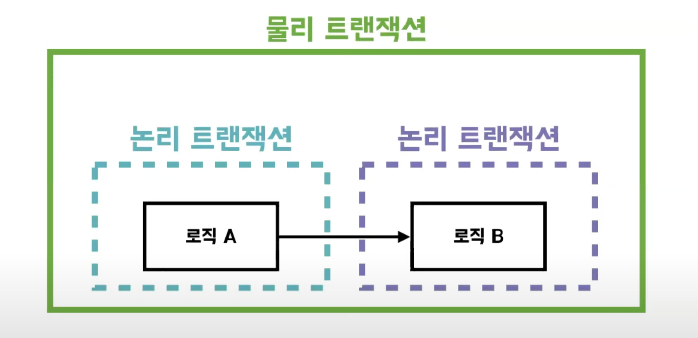

# 트랜잭션 전파 in Spring

## 트랜잭션 전파
> 진행되고 있는 트랜잭션이 있을 때 추가적인 트랜잭션을 어떻게 진행할지에 대한 방법

## 트랜잭션 전파 in Spring
> `@Transactional` 어노테이션 중 *propagation* 속성을 사용

- 물리 트랜잭션과 논리 트랜잭션

    - **물리 트랜잭션** : 실제 데이터베이스에 적용되는 트랜잭션, 실제 커넥션을 통해 트랜잭션 시작 및 종료(commit or rollback)되는 단위
    - **논리 트랜잭션** : 커밋과 롤백을 요청할 수는 있지만 실제 데이터베이스에 적용되지는 않음

- 스프링 트랜잭션 핵심 원리
> 모든 논리 트랜잭션이 커밋되어야 물리 트랜잭션이 커밋된다. 하나의 논리 트랜잭션이 롤백되면 물리 트랜잭션도 롤백된다. 신규 트랜잭션만이 물리 트랜잭션을 종료할 수 있다.

- propagation 속성들
    - **REQUIRED(default)**
    - **REQUIRES_NEW**
    ---
    - **MANDATORY**
    - **NESTED**
        - 롤백할 수 있는 여러개의 savepoint를 가지는 단일 물리 트랜잭션 사용
        - 특정한 리소스(JDBC) 트랜잭션에서만 가능하다.
    - **NEVER**
    - **SUPPORTS**
        - 현재 진행중인 트랜잭션이 있으면 참여
    - **NOT_SUPPORTED**
        - 현재 진행중인 트랜잭션이 있다면 멈추고, 본인 실행 후 다시 트랜잭션 재개
     

**REQUIRED vs REQUIRES_NEW**
 
**비즈니스 요구사항 : 영화를 예매한다. 영화 예매에 관한 기록을 로그로 저장한다. + 로그 저장에 실패해도 영화 예매는 유지된다.**

**로그 저장에 실패하는 경우**
- **REQUIRED**의 경우
    - 영화 서비스 트랜잭션 시작 영화 예매 트랜잭션 시작(기존 트랜잭션에 참여) -> 영화 예매 트랜잭션 성공 로그 저장 트랜잭션 시작(기존 트랜잭션에 참여) -> 로그 저장 트랜잭션 실패 영화 서비스 트랜잭션 롤백🔄
- **REQUIIRES_NEW**의 경우
    - 영화 서비스 트랜잭션 시작 영화 예매 트랜잭션 시작(기존 트랜잭션에 참여) -> 영화 예매 트랜잭션 성공 로그 저장 트랜잭션 시작(새로운 트랜잭션 생성) -> 로그 저장 트랜잭션 실패 -> 로그 저장 트랜잭션 롤백🔄 영화 서비스 트랜잭션 커밋✅

# 예상 질문

스프링에서 트랜잭션 전파가 어떻게 이루어지나요?

<b>propagation속성을 통해 트랜잭션 전파가 어떤 방식으로 이루어질지 선택할 수 있습니다.</b>

# 레퍼런스
- [스프링 트랜잭션 전파 10분톡](https://www.youtube.com/watch?v=b0s9RzKyHN0)
- [스프링 트랜잭션 10분톡](https://www.youtube.com/watch?v=cc4M-GS9DoY)
- [@Transactional in spring docs](https://docs.spring.io/spring-framework/docs/current/javadoc-api/org/springframework/transaction/annotation/Transactional.html)
- [transaction management in spring docs](https://docs.spring.io/spring-framework/docs/4.2.x/spring-framework-reference/html/transaction.html)