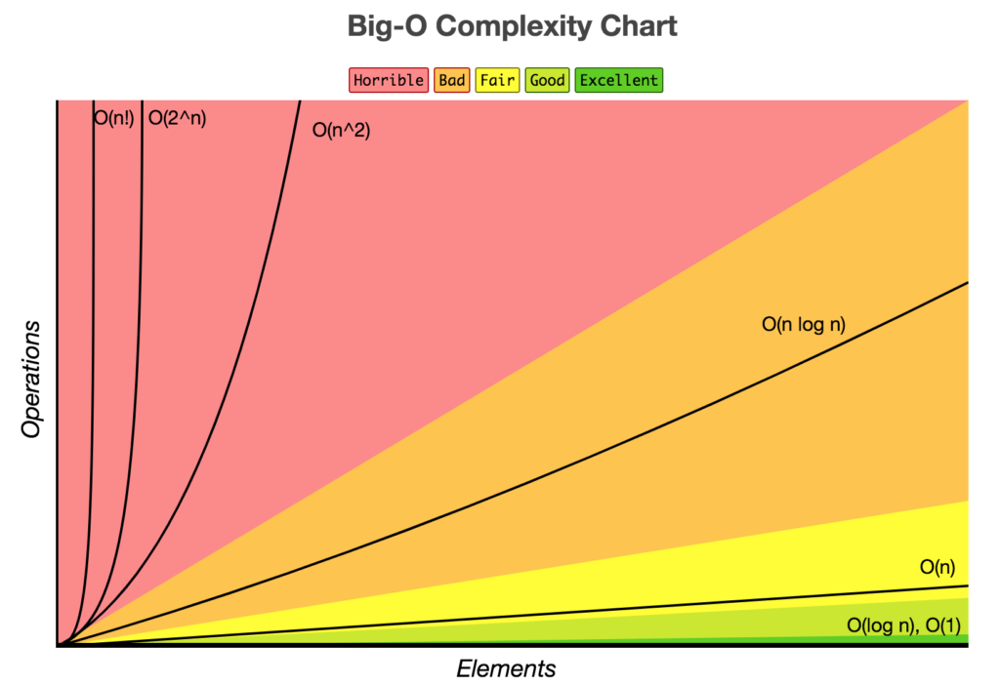

# 시간 복잡도(Time Complexity)

시간 복잡도는 알고리즘 수행 시간을 평가하는 척도

- 기본 연산(데이터 입출력, 산술 연산, 제어 연산 등)의 실행 횟수
- 최선, 최악, 평균의 세 가지 경우로 나누어 평가하며, 점근적 표기법 중 빅오 표기법을 이용하여 나타냄

# 공간 복잡도(Space Complexity)

공간 복잡도는 알고리즘을 실행하고 완료하는 데 필요한 저장 공간의 총량

고정 공간과 가변 공간으로 구성

- 고정 공간(코드 저장 공간, 단순 변수 및 상수)
- 가변 공간(실행 중 동적으로 필요한 공간)
