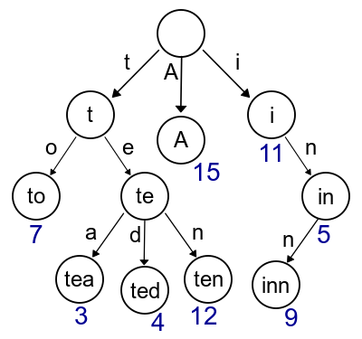

# Trie

> 문자열 검색에 주로 사용되는 탐색 트리

## 어디에 사용되나?

> 문자열의 탐색을 효율적으로!

-   검색어 자동완성
-   사전에서 찾기
-   문자열 검사

### 🔎 한글 검색에서 Trie를 잘 사용하려면?

> 한글은 영어와 다르게 자음과 모음이 합쳐져 단어가 만들어진다. 그래서 영어와 같은 방식으로 개발을 하면 ....  
> `윤` 까지 검색하면 윤선희가 나오다가  
> `윤ㅅ`을 검색하면 윤선희 라는 검색어가 사라지고 다시 `윤선`까지 검색해야 나타는 😤답답한 상황😤이 생긴다. 💢💢💢💢

 

이 문제의 해결방법은 `초성`, `중성`, `종성`을 나눠서 구현하면 영어처럼 검색기능을 개발할 수 있다!!! (feat. 곽민규)
 
## 뭐가 좋을까?

> 문자열을 단순하게 하나씩 비교하며 탐색하는 것보다 효율적

-   최대 문자열의 길이 M, 문자열들의 총 개수 N
    -   이진탐색트리 -> O(M \* logN)의 시간 복잡도로 탐색
    -   Trie -> O(M)의 시간 복잡도로 탐색 및 삽입

## 어떤 점을 고려해야 할까?

> 저장 공간의 크기

-   각 노드에서 자식의 포인터를 모두 저장하고 있어야 하므로 저장 공간의 낭비가 커진다.
    -   (포인터 크기) _ (포인터 개수) _ (총 노드의 개수) 만큼의 공간 차지

## 비슷한 거

> DAFSA(Deterministic Acyclic Finite State Automaton)

-   결정 비순환 유한 상태 오토마타
-   부가적인 정보 저장없이 키만 저장하는 경우는 Trie보다 적은 공간을 사용한다.
    -   서로 다른 키에서 접미사를 공유하는 경우 동일한 노드(가지)를 활용하는 방식으로 공간을 압축한다.
-   구현이 Trie보다 복잡하고, 문자열 집합에 변경이 자주 일어날 경우 관리가 어렵다.

# 예상 질문

-   트라이에 대해 설명해주세요
-   트라이가 주로 쓰이는 문제와 왜 그 문제를 해결하는 데 쓰이는지 설명해주세요

# 레퍼런스

-   [트라이 위키](<https://ko.wikipedia.org/wiki/%ED%8A%B8%EB%9D%BC%EC%9D%B4_(%EC%BB%B4%ED%93%A8%ED%8C%85)>)
