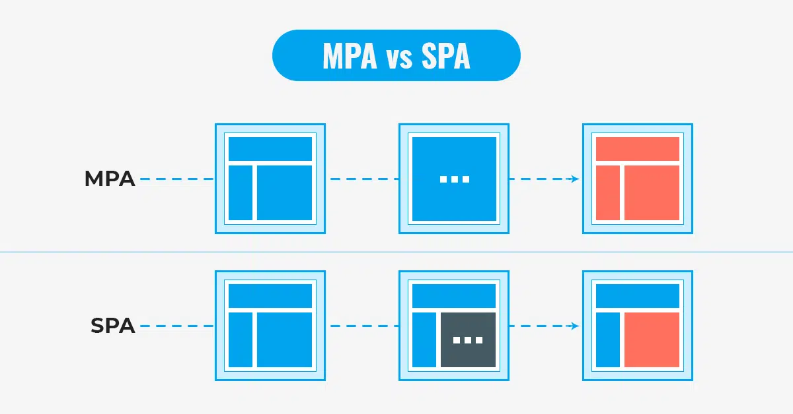

# 목표

SSR과 CSR의 차이점을 이해한다.

## 예상 질문

1. 브라우저 렌더링 방식에 대해 설명해주세요.
2. React와 Next의 차이점은 무엇인가요?
3. React에서 CSR과 SSR의 차이점은 무엇인가요?
4. CSR과 SSR의 장단점은 무엇인가요?
5. MPA와 SPA의 차이점은 무엇인가요?

# 브라우저 렌더링 과정의 기본

## SPA(Single Page Application)와 MPA(Multi Page Application)

> SPA는 웹 어플리케이션에서 필요한 모든 정적 리소스를 최초 한 번에 로드한다.

- 이후 페이지 전환 시, 전체 페이지를 다시 로드하는 것이 아니라 **필요한 데이터만 서버에서 가져와 동적으로 페이지를 갱신**한다.
- SPA를 대체로 CSR(Client Side Rendering) 방식으로 렌더링한다고 말한다.
  - 주의) 이해를 위한 설명이지, 모든 SPA가 CSR 방식으로 렌더링하는 것은 아니다.

> MPA는 각 페이지가 별도의 HTML로 구성되어 있다.

- 이후 페이지 전환 시, 새로운 HTML 페이지를 서버로부터 로드하여 렌더링한다.
- MPA는 주로 SSR(Server Side Rendering) 방식으로 렌더링한다고 말한다.
  - 주의) 똑같이 MPA에서도 특정 부분에서 CSR 방식으로 렌더링하는 것이 가능하다. 하지만 전통적으론 MPA는 SSR 방식을 사용한다.

## 브라우저 렌더링 과정 SSR (Server Side Rendering), CSR (Client Side Rendering)

### SSR (Server Side Rendering)

> 서버로부터 **렌더링된 HTML파일을 받아**와 페이지를 렌더링한다.

장점 : 빠른 초기 로드

단점 : 서버 부하

예시: 영화 예매 사이트에 접속했을 때, 원하는 영화, 시간, 좌석 정보가 이미 페이지에 표시되어 있는 상태로 로딩된다.

### CSR (Client Side Rendering)

> 웹 페이지의 초기 콘텐츠가 **클라이언트(브라우저)에서 자바스크립트를 통해 동적으로 렌더링**된다.

장점 :

- 동적 상호작용 - 사용자와의 상호작용에 따라 페이지를 빠르게 업데이트할 수 있다.
- 서버 부하 감소 - 서버는 데이터만 제공하고 클라이언트에서 렌더링하기 때문에 서버 부하가 줄어든다.

단점:

- 느린 초기 로드: 필요한 자바스크립트 파일을 모두 다운로드하고 실행한 후에 페이지 콘텐츠가 렌더링되기 시작한다.

예시: 소셜 미디어 사이트에 접속했을 때, 처음에는 로딩 아이콘이 보이다가, 몇 초 후에 타임라인의 게시물들이 화면에 나타나게 된다.

Q. 만약, 세모만 네모로 변경하게 되면 어떻게 될까? (SSR, CSR)
