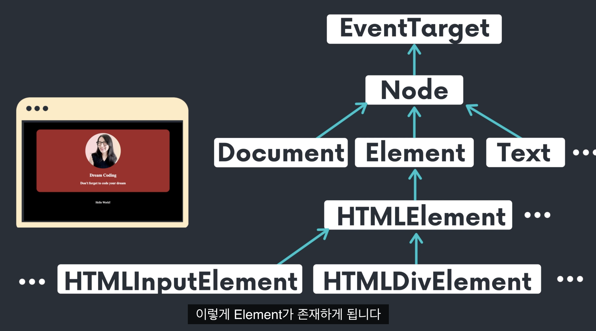
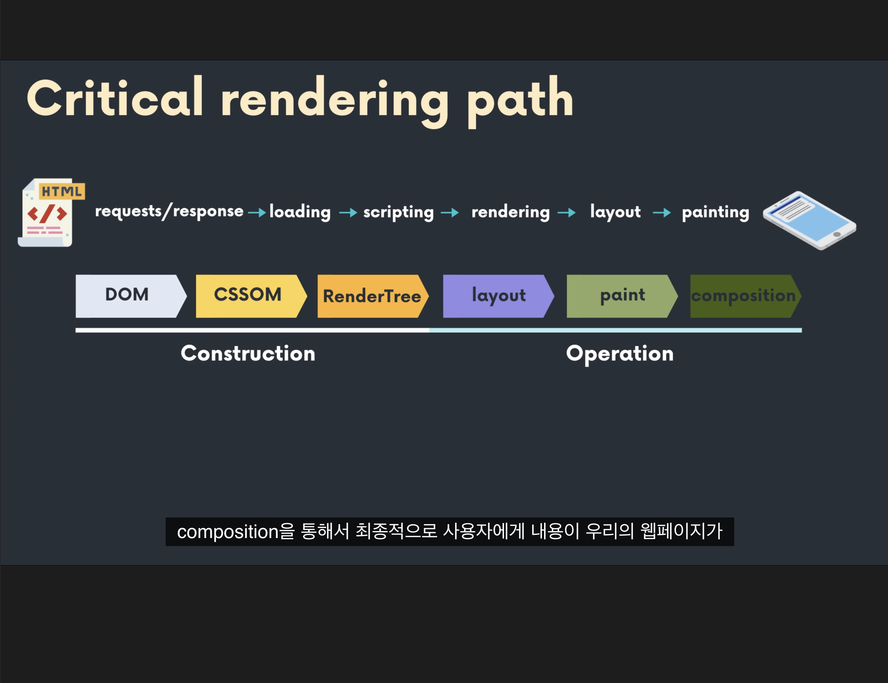

# 목표

브라우저의 동작원리를 이해하고,이에 기반한 웹의 렌더링 방법에 대해 학습한다.

## 예상 질문

1. 브라우저 렌더링 과정에 대해 설명해주세요.
2. DOM과 CSSOM의 차이점은 무엇인가요?

## 기초 브라우저의 동작 원리

> 브라우저에서 웹 페이지를 열게 되면 Window라는 전체적인 오브젝트가 존재한다.

- 페이지 뿐만 아니라 브라우저에서 현재 열려있는 전체적인 창 자체를 의미한다.

> 그리고 페이지가 표기되는 부분이 Document 오브젝트이다.

- 즉, 우리가 HTML에서 작성한 요소들이 표기되어지는 부분이라고 볼 수 있다.

그리고 사용자 눈에는 안보이지만 Window에 관련된, 다시 말해 브라우저 자체에 관련된 정보들이 담겨있는 Navigator 오브젝트가 존재한다.

 

### 내가 페이지를 브라우저에서 열게 되면

Window라는 전체적인 오브젝트가 있고 그 Window안에는 DOM들이 들어있고 이것을 이용해서 **새로운 요소를 추가, 빼거나 움직이는게 가능하게 된다.**

또한 BOM이라는 건, Browser Object Model의 약자로 브라우저에 관련된 Navigator나 Location이나 Fetch나 Storage같은 위에서 살펴 본 Web APIs에 관련된 오브젝트들이 들어있다.

- ex) Location은 현재 페이지의 주소를 알려주는 오브젝트이다.
  - React의 useLocation이나 useHistory처럼 React에서도 사용하고 있다.

그래서 우리가 자바스크립트로 브라우저 위에서 동작하는 걸 만들 때는 **DOM에 관련된 API도 사용**해도 되고, **BOM에 관련된 API도 쓸 수 있는 것**이다.

## DOM에 대해서 간단히 알아보자.

DOM은 Document Object Model의 약자로, HTML이나 XML 문서를 프로그래밍 언어에서 사용할 수 있도록 **트리 구조로 구성**해놓은 것이다.

> 다시 쉽게 풀어서 설명하자면

1. 브라우저는 HTML 문서를 위에서 아래로 한 줄씩 읽게된다.
2. 읽은 HTML 문자열을 토큰화시킨다. 예를 들면 `<html>`이라는 태그를 만나면 `<html>`이라는 태그를 토큰화시키고, `Hello World`라는 문자열을 만나면 `Hello World`라는 문자열을 토큰화시킨다.
3. 토큰화된 결과를 바탕으로 DOM 트리를 구축한다.

> - Element Node: 태그에 해당하는 노드 (예: `
`, `<a>`, `
` 등)
> - Text Node: 텍스트 내용에 해당하는 노드 (예: "Hello, World!")
> - Document Node: 전체 문서를 대표하는 노드

## 브라우저가 HTML을 분석해 그 요소들을 DOM으로 변환했는데, 그럼 내 CSS는 어디로 가나요?

> 브라우저에서 DOM을 만들게 되면, 우리가 정의한 CSS와 병합해 CSSOM이라는 트리를 만들게 된다.

1. 브라우저가 HTML파일을 읽게되면 제일 처음 Document Object Model트리를 만들게 된다.
2. 그 후에 CSS파일을 읽어 전부 다 계산해 최종적으로 확정된 CSS스타일의 트리를 만든다(CSSOM)
3. 그리고 DOM과 CSSOM을 합해서 최종적으로 브라우저에 표기되는 Render트리에 선별되어 표기되어진다.

# 이제 렌더링 과정에 대해 설명할 수 있다.

> **HTML 요청** : 먼저 브라우저가 서버에게 HTML 파일을 요청하게 된다.(HTTP requests / response)

> **HTML 읽기 및 DOM 생성** : 브라우저는 받아온 HTML 파일을 위에서부터 한 줄씩 읽으면서 DOM(Document Object Model) 트리를 구성한다.

> **CSSOM 생성** : 별도로 링크된 CSS 파일을 요청하거나 내장된 스타일을 읽어서 CSSOM(CSS Object Model) 트리를 구성한다.

> **Layout(Reflow)** : Render Tree를 기반으로 각 노드의 위치와 크기를 계산한다.

> **Painting** : 화면에 실제 요소들을 그린다. 여기서는 텍스트의 색상, 배경 이미지, 그림자 등의 시각적 스타일이 적용된다.

> **Composite** : 여러 레이어를 합쳐서 최종적으로 화면에 표시될 이미지를 생성합니다.

> **Layout** : 이렇게 Rendering tree를 만든 후 각각의 요소들이 어떤 위치에 얼마나 크게 표기될 건지 계산한다.

> **Painting** : 계산 후 그림을 그린다.

### 마무리

> 질문 : 브라우저 렌더링 **과정**에 대해 설명하세요.

대답 : 브라우저는 크게 4단계를 거쳐 랜더링을 수행합니다.

- **요청** : 브라우저 -> 서버에 요청 : 서버에 필요한 리소스를 요청
- **트리 생성** : 브라우저의 렌더링 엔진-> HTML,CSS => DOM+CSSOM =랜더 트리 생성
- **Layout** : 브라우저의 자바스크립트 엔진 -> JS는 => DOM API사용해 랜더 트리 변경, 리플로우 리페인트
- **페인팅(repaint)** : 실제 그리기 렌더 트리를 기반으로 HTML요소의 레이아웃 계산, HTML요소 페인팅
