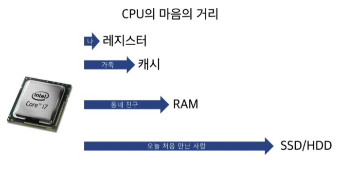

> :bulb: **소프트웨어 vs 펌웨어**  
> `펌웨어` : 하드웨어 + 소프트웨어 (≒ `BIOS`)  
> **ROM** (Read Only Memory)에 저장된 하드웨어를 제어하는 마이크로 프로그램  
> 가장 최소한의 기본적인 프로그램  
> 영구적인 명령어와 데이터로 이루어져 있음 (최근에는 업데이트를 통해 새로 배포하는 형식)  
> 장치 드라이버를 통해 구동
>
> `소프트웨어` (OS, Application ..) 는 **RAM**에서 구동

 

> :bulb: `CPU` (Centeral Processing Unit)  
> 산술논리연산장치, 제어장치, 레지스터로 구성  
> 메모리에 존재하는 명령어를 해석해서 실행하는 일꾼  
> => 컴퓨터는 사용자의 명령을 입력받으면, CPU가 이 명령을 해석하고, 처리(연산) 해서 출력 장치에서 결과를 출력

 

> :bulb: **RAM vs ROM**  
> `RAM` (Random Access Memory) : 휘발성 (전원이 차단되면 데이터 소멸)  
> `ROM` (Read Only Memory) : 비휘발성 (전원이 차단되어도 데이터 소멸 X), 공장에서 ROM에 `BIOS` 설치되어서 나옴

 

# 🖥 메모리

- 전자 회로에서 데이터, 상태, 명령어 등을 기록하는 장치
- 보통 `RAM`(Random Access Memory)을 일컫음
- **CPU는 계산 담당, 메모리는 기억 담당**

## 🔺 메모리 계층

- 레지스터

  - CPU 안에 있는 작은 메모리
  - 휘발성
  - CPU와 직접 연결되어 있음 (CPU는 자체적으로 데이터를 저장할 방법이 없기 떄문에 레지스터를 거쳐 데이터 전달)

- 캐시 (아래에서 자세히..)

  - L1, L2, L3 캐시 (Level)
    - 캐시 메모리의 작동 순서가 L1에서 순차적으로 데이터를 찾아, 없다면 순서대로 L2, L3로 올라가며 데이터를 찾는 것
  - 휘발성
  - 데이터를 미리 복사해 놓는 임시 저장소, 병목 현상을 줄이기 위한 메모리
  - 데이터 접근 시간 및 다시 계산하는 시간 절약

- 메모리(주기억 장치, RAM)

  - 휘발성
  - 하드디스크로부터 데이터를 복사해서 임시 저장 및 필요시마다 `CPU`로 빠르게 전달
  - **어느 위치에든 똑같은 속도**로 접근하여 읽고 쓸 수 있다는 의미로 Random Access

  > `로딩중` : 하드디스크 또는 인터넷에서 데이터를 읽어 RAM으로 전송하는 과정이 아직 끝나지 않음

- 하드 디스크(보조기억 장치)

  - HDD, SSD
  - 비휘발성

## 📀 캐시

> 미리 쓸만한 데이터를 메인 메모리에서 캐시에 옮겨놓자!!

### 시간 지역성 vs 공간 지역성

- 시간 지역성 : **최근 사용한 데이터**에 다시 접근하려는 특성
- 공간 지역성 : **최근 접근한 데이터**를 이루고 있는 공간이나 그 가까운 공간에 접근하려는 특성

### 캐시 히트 vs 캐시 미스

- 캐시 히트 : 캐시에서 원하는 데이터를 찾음
- 캐시 미스 : 캐시에 없다면 주메모리로 가서 데이터를 찾아오는 것
- ex) Redis에 데이터 존재하면 `캐시 히트`, Redis에 없다면 MariaDB로 가서 데이터 가져오는 것이 `캐시 미스`

### 웹 브라우저 캐시

- 쿠키
  - 만료 기한이 **있는** Key-Value 저장소
  - 4KB까지 저장 가능
  - 만료 기한 설정 가능 (보통 서버에서 설정)
  - `document.cookie`로 쿠키를 볼 수 없게 `httponly` 옵션 거는 것이 중요
  - `same site` 옵션을 `strict`로 설정하지 않으면 다른 도메인에서 요청했을 때 자동 전송
- 로컬 스토리지
  - 만료 기한이 **없는** Key-Value 저장소
  - 10MB까지 저장 가능
  - 웹 브라우저를 닫아도 유지
  - 도메인 단위로 저장, 생성
  - 클라이언트에서만 수정 가능
- 세션 스토리지
  - 만료 기한이 **없는** Key-Value 저장소
  - 탭 단위로 생성, 닫으면 데이터 소멸
  - 5MB까지 저장 가능
  - 클라이언트에서만 수정 가능

 

# :question: 예상 질문

왜 불편하게 전원이 차단되면 모든 기억된 내용이 지워지는 휘발성 장치를 사용할까요?

 
아직 휘발성 특성, 단점을 가진 기계적 부품 이외에는 주기억장치의 역할을 할 부품이 상용, 양산화가 힘들기 때문이다.

<b>빠른 속도와 효율</b>을 제공해주기 때문에 휘발성임에도 불구하고 사용된다. 만일 기술의 발전으로 다른 방법이 생기면 이러한 단점이 사라질 수도 있다.

 

RAM을 주기억장치라고 표현하는 이유는 무엇인가요?

 
컴퓨터가 어떠한 프로그램을 실행하게 된다면,

1. 보조기억장치(HDD, SSD)에서 주기억장치(RAM)로 프로그램을 불러온다. (부팅 또는 로딩)

2. 주기억장치에서 프로그램을 기억하고 CPU와 통신할 준비를 한다. (동작 및 구동)

3. 주기억장치와 CPU에서 데이터를 주고받으며 프로그램을 구동한다. (동작 및 구동)

이처럼 주기억 장치는 작업을 처리하는 CPU가 일하는 일터의 개념이기 때문에 주기억 장치라 표현합니다.

 

# :newspaper: Reference

[주기억장치 - 해시넷](http://wiki.hash.kr/index.php/%EC%A3%BC%EA%B8%B0%EC%96%B5%EC%9E%A5%EC%B9%98)
 
[CS질문정리](https://eunsun-zizone-zzang.tistory.com/48)
