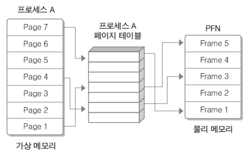
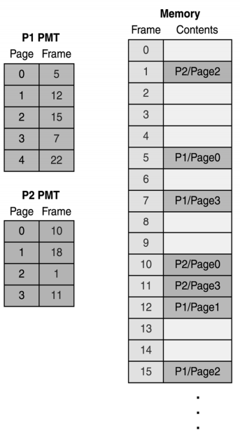
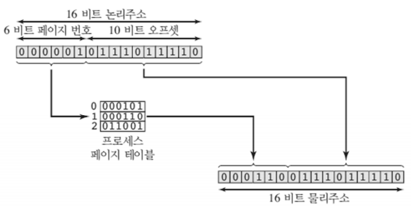
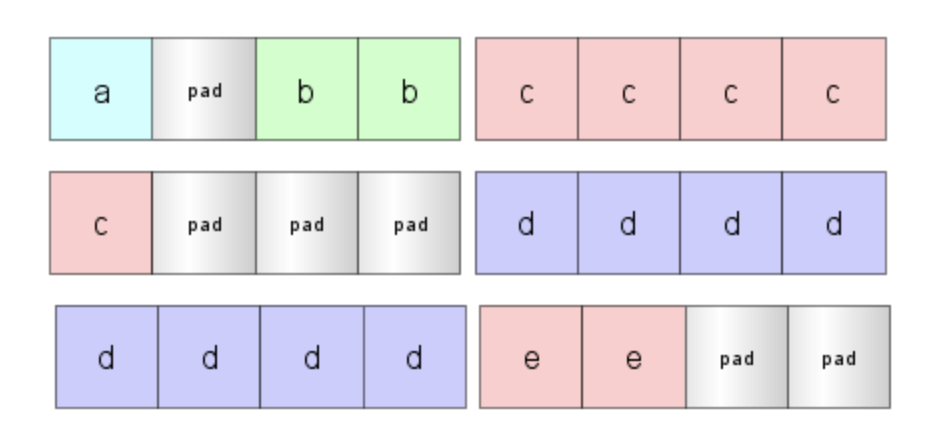
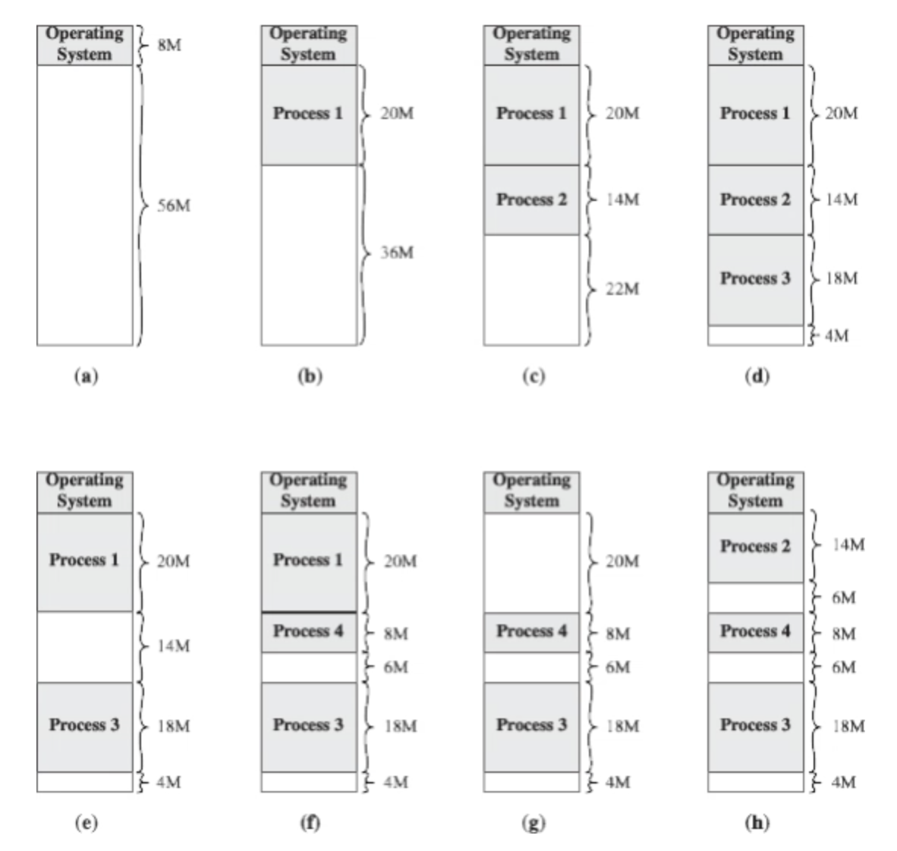

# 📬 페이징과 세그멘테이션

## 📄 페이징

  > 프로세스의 주소 공간을 고정된 물리적 사이즈인 페이지로 나누어 물리적 메모리에 불연속적으로 할당하는 방식

- 프로세스의 가상 주소 공간을 **고정적인 크기(fixed-sized) 단위인 페이지로 나누어서 메모리에 할당**하는 방식

- 가상공간의 페이지를 실제 메모리에 할당할 때 이를 **페이지 프레임(Figure 1)**이라고 함

    

    [ **Figure 1** 페이지 테이블 ]

- 프로세스별로 페이지 테이블을 하나씩 가지며, 메인 메모리의 페이지 번호와 해당 페이지의 시작 주소를 저장함(**Figure 2**)

  

  [ **Figure 2** 페이징 테이블과 메인 메모리 ]

- 물리적 주소를 찾을 때 **페이지 주소 + 페이지에서의 오프셋 형태(Figure 3)**로 찾게 됨

  
  
  [ **Figure 3** 페이지 테이블 ]
  
- 외부 단편화가 생기지 않음

- 여전히 내부 단편화(**Figure 4**) 문제 발생

  
  
  [ **Figure 4** 내부 단편화 ]
  
- 페이지 크기를 작게 한다면....?

  - 내부 단편화 문제는 적어짐
  - 페이지 매핑 과정이 더 복잡해짐
  - 결과적으로 더 비효율적
  
   
  

## 🗂️ 세그멘테이션

  > 프로세스의 주소 공간을 서로 사이즈가 다른 논리적인 내용 단위로 분리해 물리적 메모리에 불연속적으로 할당하는 방식

  - 프로세스의 가상 주소 공간을 **논리적인 크기(fixed-sized) 단위인 세그먼트로 나누어서 메모리에 할당**하는 방식

  - method, procedure, function, object, variables, stack 등의 단위로 나누게 됨(**Figure 5**)

    

    

    [ **Figure 5** 세그멘테이션 ]

- 페이징과 마찬가지로 프로세스마다 세그먼트 테이블(**Figure 6**)을 가지고 있음

  

  [ **Figure 6** 세그먼트 테이블 ]

- 물리적 주소를 찾는 방법은 페이지에서와 동일

- 내부 단편화가 생기지 않음

- 프로그램의 중요한 부분과 중요하지 않은 부분을 분리해 저장하거나, 같은 코드 영역은 한번에 저장할 수 있어 보호과 공유 측면에서 좋음

- 여전히 외부 단편화(**Figure 7**) 문제 발생

​	[ **Figure 7** 외부 단편화 ]

 

## 🤼‍♀️ 페이징 VS 세그멘테이션

  > 돼지를 도축할 때 한 근 단위로 나누면 테이블, 부위마다 다른 크기로 나누면 세그멘테이션

| 구분             | 페이징                                            | 세그멘테이션                                                 |
| ---------------- | ------------------------------------------------- | ------------------------------------------------------------ |
| 메모리 분할 단위 | 고정된 크기의 페이지                              | 논리적 단위인 세그먼트                                       |
| 장점             | 외부 단편화 해결 | 내부 단편화 해결, 보호와 공유 |
| 단점             | 내부 단편화        | 외부 단편화                   |

  - 세그먼트를 페이징하는 방법으로 세그멘테이션의 장점(보호와 공유)과 페이징의 장점(외부 단편화 해결)을 모두 가져갈 수 있지만 속도 측면에서 살짝 불리하다.

   

# ❓ 예상 질문

  

    
<b>페이징에 대해 설명해주세요</b>

    

    페이징은 프로세스의 주소 공간을 고정된 물리적 사이즈인 페이지로 나누어 물리적 메모리에 불연속적으로 할당하는 방식입니다.
    

  

  

    
<b>페이징의 장단점에 대해 설명해주세요</b>

    

    페이징을 하면 외부 단편화가 생기지 않는다는 장점이 있지만, 내부 단편화 문제가 발생할 수 있습니다. 페이지 단위를 작게 하면 내부 단편화 문제를 어느 정도 해결할 수 있지만, 페이지 매핑 과정이 복잡해져 더 비효율적입니다.
    

  

  

    
<b>세그멘테이션에 대해 설명해주세요</b>

    

    세그멘테이션은 프로세스의 주소 공간을 서로 사이즈가 다른 논리적인 내용 단위로 분리해 물리적 메모리에 불연속적으로 할당하는 방식입니다.
    

  

  

    
<b>세그멘테이션의 장단점에 대해 설명해주세요</b>

    

    세그멘테이션을 사용하면 내부 단편화가 생기지 않고 보호와 공유 차원에서 이점이 있지만, 외부 단편화 문제가 발생할 수 있습니다.
    

  

  

    
<b>페이징과 세그멘테이션을 비교해주세요</b>

    

    페이징과 세그멘테이션 모두 프로그램을 실행하기 위해 디스크에 있는 내용을 분할하여 메모리에 적재하는 불연속 메모리 관리 기법입니다. 둘의 차이는 프로그램을 분할하는 방식입니다. 페이징의 경우 프로그램을 같은 크기의 페이지로 분할하는 데에 비해, 세그멘테이션은 논리적 의미를 기준으로 세그먼트를 분할합니다.
    

  

   

# 👁‍🗨 Reference

  - [페이징(Paging)](https://github.com/devSquad-study/2023-CS-Study/blob/main/OS/os_paging.md)
  - [[운영체제]페이징과 세그멘테이션](https://steady-coding.tistory.com/524)
  - [[운영체제] 페이징과 세그멘테이션](https://bellog.tistory.com/159)
  - [운영체제 20장 - 메모리 관리(7) : 세그멘테이션(Segmentation) -](https://copycode.tistory.com/108)

