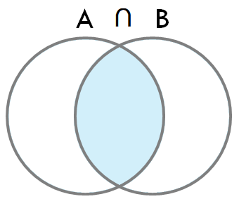
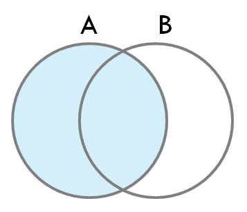

# Join

## Join이란?

> 2개 이상의 테이블을 결합하는 과정

## 왜 쓰나?

> 정규화를 진행하면 서로 관계있는 데이터가 여러 개의 테이블에 분산 저장되므로 효율적인 데이터 검색을 위해 조인이 필요하다

## 조인 종류

> **한쪽 테이블에만 존재하는 행의 출력 여부**를 기준으로!

### Inner Join

> 서로 겹치는 데이터만!

 

-   조인 키 값에 따라 양쪽 테이블에서 공통적인 데이터만 반환

### Left Outer Join

> 서로 겹치는 데이터 + 남는 나머지 왼쪽 테이블 데이터도

 

-   Inner Join 데이터
-   나머지 왼쪽 테이블의 데이터도 오른쪽 데이터 속성은 null로 표시하여 반환

### Right Outer Join

> 서로 겹치는 데이터 + 남는 나머지 오른쪽 테이블 데이터도

 

-   Inner Join 데이터
-   나머지 오른쪽 데이터도 왼쪽 데이터 속성은 null로 표시하여 반환

### Full Outer Join

> 서로 겹치는 데이터 + 남는 양쪽 테이블 데이터도

 

-   Inner Join 데이터
-   나머지 모든 데이터도 각자 반대 테이블의 속성은 null로 표시하여 반환

## 조인 방식

> **각 row 매핑시의 메커니즘 종류**를 기준으로!

-   Oracle 기준이에요 ┗|｀ O′|┛

### NL(Nested Loop) Join

> 계속 **반복**해서 조인 작업 수행

### Hash Join

> **조인 키 컬럼 값의 해시 함수 결과**를 이용해 조인 작업 수행

### Sort merge Join

> 조인 키 컬럼 값을 기준으로 각 데이터 셋을 정렬 후, 작은 값부터 양쪽 키 값과 매칭되는 지 확인

# 예상 질문

Join 종류에 대해 말해보세요

<b>Inner, Left Outer, Right Outer, Full Outer Join이 있어요</b> .______.

# 레퍼런스

-   https://sparkdia.tistory.com/17
-   https://sparkdia.tistory.com/18
