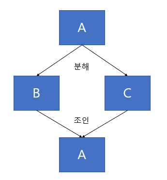
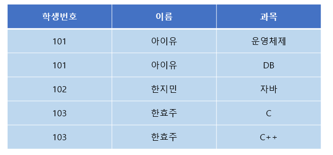
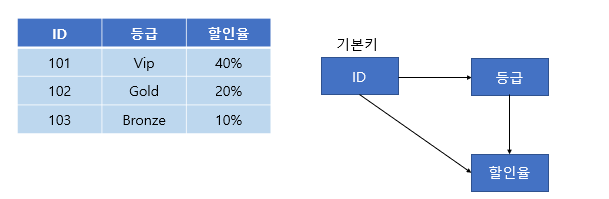
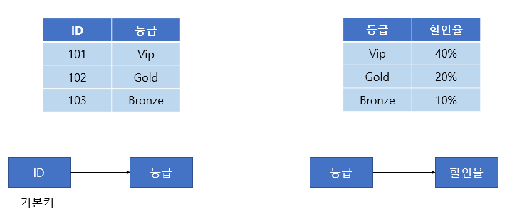
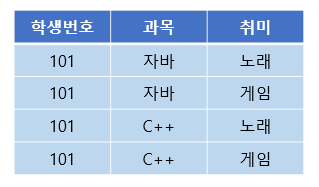
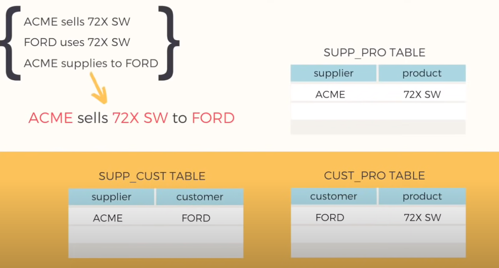

# 정규화

## 정규화란?

> 관계형 데이터베이스에서 중복을 최소화하게 데이터를 구조화하는 과정

## 장점

-   데이터베이스 변경 시, 이상현상 방지
-   데이터베이스 확장 시, 구조변경 최소화

## 단점

-   JOIN 연산이 많아짐 -> 성능 저하로 이어질 수 있음

## 도부이결다조

### 알아야 할 것

-   **종속적이다** : 나건(이름)과 0942867(학번)의 경우, 학번이 이름을 결정하므로 이름은 학번에 종속적이다.
-   **함수 종속성** : 데이터들이 어떤 기준값에 의해 종속되는 현상 **결정자** -> **종속자**
    -   결정자 : 기준값
    -   종속자 : 종속되는 값
-   **이행 종속성** : A -> B이고, B -> C이면 A -> C이다. 이때, C가 A에 이행 종속되었다고 한다.
-   **다치 종속** : A -> B일 때, 하나의 A값에 여러개의 B값이 존재하면 다치 종속성을 가진다.
-   **조인 종속** :   하나의 릴레이션을 무손실 분해했다가 다시 결합가능하면 조인 종속성을 가진다. 즉, 결합했을 때 data를 잃거나 새로운 information이 생성되면 조인 종속성이 없는 것이다.

### 제 1정규화 : 원자값이 아닌 도메인을 분해

> 한 컬럼엔 한 속성만!

 
**😜과목 컬럼에 2개의 값이 존재**

 
**✔한 컬럼이 하나의 값을 가지도록 변경**

### 제 2정규화 : 부분 함수종속 제거

> 일반 속성은 주 식별자(PK) 일부분이 아닌 전체에 종속적이어야 된다

 
**😜지도교수는 학번없이 과목에만 부분 종속적**

 
**✔과목->지도교수 부분 종속성은 따로 분리**

### 제 3정규화 : 이행 함수종속 제거

> 한 테이블에 이행 함수종속을 분리시켜주자

 
**😜ID -> 등급, 등급 -> 할인율 이면, ID -> 할인율인 이행 함수종속 존재**

 
**✔이행 종속성을 분리해주자**

### 보이스-코드 정규화 : 결정자가 후보키가 아닌 함수종속 제거

> 후보키가 아닌 컬럼이 결정자가 되서는 안된다 즉, 모든 결정자는 후보키이어야 한다

 
**😜후보키가 아닌 컬럼(지도교수)가 결정자인 함수종속 존재 : 지도교수 -> 과목**

 
**✔지도교수를 키본키로 하는 테이블로 분리**

### 제 4정규화 : 다치종속 제거

> 다치(다중) 종속을 제거하자

 
**😜학생번호 하나에 과목 여러개와 취미 여러개가 종속됨**

 
**💥학생번호를 가지고 조회하면 과목과 취미는 관계가 없어서 중복 발생**

 
**✔2개 이상의 컬럼이 한 컬럼에 다치중속되지 않도록 분리**

### 제 5정규화 : 후보키를 통하지 않은 조인종속 제거

> information 손실이 없으면 테이블 분해하자.

 
supplier, product, customer가 기본키인 테이블 존재 첫 번째 행이 주는 정보 : **ACME가 FORD 고객에게 72X SW를 판매함**

 
💥위 그림처럼 SPC테이블을 분해하면 **"ACME이 72X SW를 팔았다"** **"FORD가 72X SW를 사용한다"** **"ACME가 FORD의 공급처이다"** 라는 정보를 얻을 수 있지만  그것이 **"ACME가 FORD 고객에게 72X SW를 판매함"** 이라는 정보로 이어지지는 않음 즉, 정보의 손실 발생

# 예상 질문

정규화에 대해 아는대로 말해보세요

༼ つ ◕_◕ ༽つ<b>도부이결다조</b>

# 레퍼런스

-   https://code-lab1.tistory.com/48
-   https://code-lab1.tistory.com/270
-   https://www.youtube.com/watch?v=mbj3HSK28Kk
