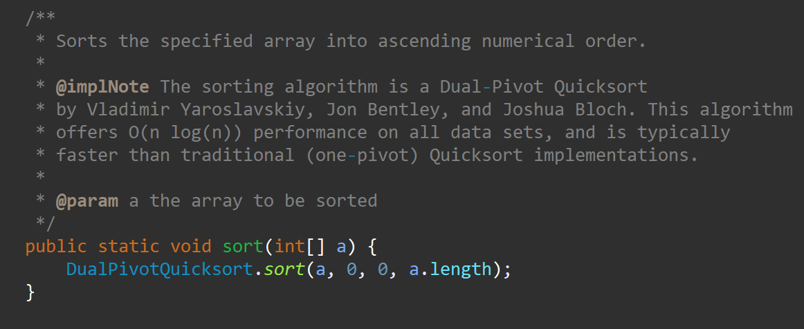
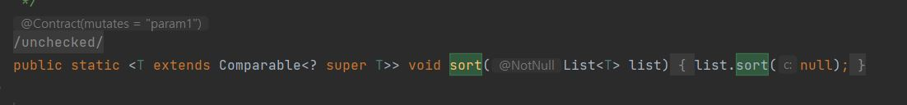
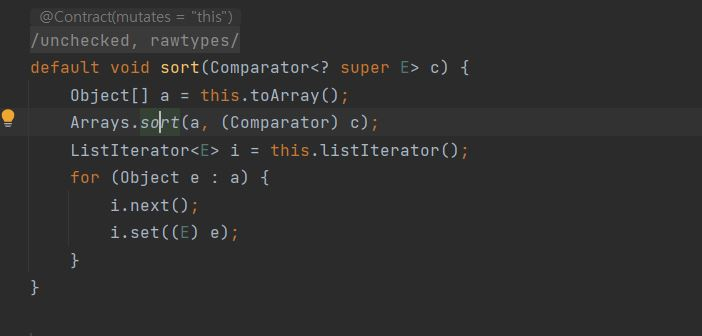
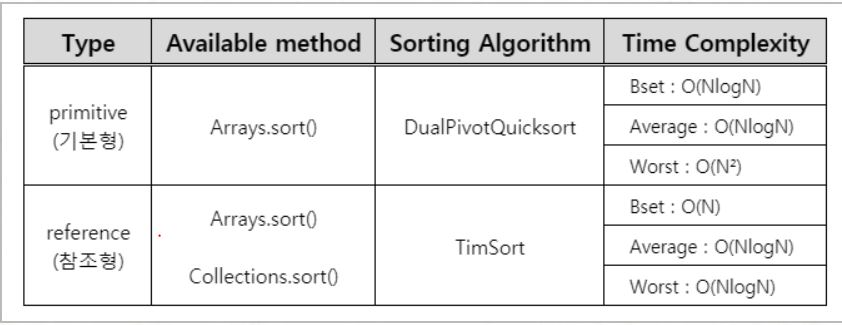

# 알고리즘 예상 질문

 

## ⭐ 시간복잡도와 공간복잡도가 무엇인지 설명해주실 수 있을까요?
> **시간복잡도**: 알고리즘이 문제를 해결하기 위해 `필요한 시간`을 나타내는 척도입니다. 이를 통해 데이터 크기에 따른 알고리즘의 실행 `시간 증가율`을 대략적으로 예측할 수 있습니다. 시간복잡도는 종종 `Big O 표기법`으로 표현되며, 주로 입력 크기에 따른 최악의 경우를 기준으로 합니다.   
> **공간복잡도**: 알고리즘이 문제를 해결하는 데 `필요한 메모리 양`을 나타내는 척도입니다. 시간복잡도와 마찬가지로 `Big O 표기법`으로 표현되며, 필요한 저장 `공간의 증가율`을 예측하는 데 사용됩니다. 

 

## ⭐ 재미있게 공부한 알고리즘이 있다면 설명해주실 수 있을까요?
> 면접 가기전에 하나씩 생각해두면 좋을 것 같습니다. 

 

## ⭐ 포트폴리오에서 시간복잡도를 낮춘 사례가 있다면 설명해주실 수 있을까요?

이 부분은 구글링한 예시를 가져왔습니다.

- **데이터 구조의 최적화**: 적절한 자료구조의 선택은 알고리즘의 성능을 크게 향상시킬 수 있습니다. 예를 들어, 배열에서 요소를 찾는 데 O(n)의 시간이 걸리는 반면, 해시맵에서는 O(1)의 시간이 걸립니다.

- **알고리즘 최적화**: 종종 더 효율적인 알고리즘을 찾거나 현재의 알고리즘을 최적화하여 성능을 향상시킬 수 있습니다.

- **메모이제이션**: 이미 계산된 결과를 저장해 두고 나중에 재사용하는 기법으로, 동적 프로그래밍에서 주로 사용됩니다.

- **병렬 처리**: 멀티 코어나 분산 시스템을 활용하여 여러 작업을 동시에 처리하도록 설계하여 시간을 절약할 수 있습니다.

> [출처: theon2.log](https://velog.io/@theon2/%EA%B8%B0%EC%88%A0%EB%A9%B4%EC%A0%91-%EC%98%88%EC%83%81%EC%A7%88%EB%AC%B8-%EC%95%8C%EA%B3%A0%EB%A6%AC%EC%A6%98)

 

## ⭐ 정렬 알고리즘에는 무엇이 있는지 말해주고, 예시로 하나 자세히 설명해주세요.
> 정렬 알고리즘에는 삽입정렬, 선택정렬, 버블정렬, 퀵정렬, 힙정렬, 병합정렬이 있습니다. 
 

[정렬 알고리즘 간단 정리](https://dev-coco.tistory.com/160)

  

## ⭐ Java에서 Arrays.sort()와 Collections.sort() 비교
> Java에서 제공하는 정렬인 Arrays.sort() 와 Collections.sort()은 서로 다른 정렬 알고리즘으로 구현되어있다.

### 👉 Arrays.sort() : DualPivotQuicksort
   

평균 O(nlog(n))의 시간복잡도를 가지며 최악의 경우 O(n^2)이 될 수 있다.

### 👉 Collections.sort() : Timsort
  
  
여기서 Collections.sort() 파라미터로 Comparable을 넘겨준다.   
   

Timsort란 `삽입 정렬 + 병합정렬`을 결합하여 만든 하이브리드 정렬이라고한다.  
Timsort의 시간복잡도는 평균 O(n log(n)) 이며 최악의 경우도 O(n log(n)) 이다.  
삽입정렬의 평균 시간 복잡도가 O(n^2) 인데 이건 뭐지??? 하면 Timsort란 무엇인지 자세히 알아보아야한다....  

[TimSort란?](https://d2.naver.com/helloworld/0315536)

#### 👏결론
  

  

# :newspaper: Reference
[알고리즘 CS질문 정리](https://dev-coco.tistory.com/160)