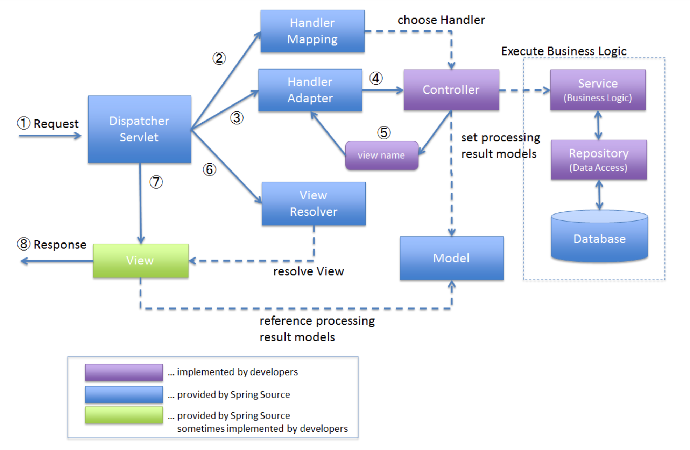

# 🍃 Spring MVC
> `MVC` : Model - View - Controller
- **Model** : 데이터와 비즈니스 로직을 관리
- **View** : 레이아웃과 화면을 처리
- **Controller** : 모델과 뷰로 명령을 전달

 

## 🌊 동작 흐름

1. 클라이언트 요청을 `Dispatcher Servlet`이 받음
2. `Dispatcher Servlet`이 `Handler Mapping`으로 요청을 위임
3. `Handler Mapping`이 처리할 `Controller`를 찾아서 `Dispatcher Servlet`으로 반환
4. `Dispatcher Servlet`이 `Controller`객체를  처리할 수 있는 `Handler Adapter`로 처리 위임
5. `Handler Adapter`는 `Controller`의 알맞은 메소드를 호출하여 요청을 처리(비즈니스 로직)하고 `Dispatcher Servlet` 으로 결과(`ModelAndView`) 리턴
6. `Dispatcher Servlet`은 결과를 보여줄 `View`를 찾기 위해 `ViewResolver`를 이용
7.`Dispatcher Servlet`은 `ViewResolver`가 반환한 `View`객체에게 응답 결과 생성 요청
8. `View`객체는 적절한 응답 생성

 

## 🎮 Dispatcher Servlet
- HTTP 프로토콜로 들어오는 모든 요청을 받아 적합한 컨트롤러에게 위임하는 **Front Controller**
- 이전에는 모든 `Servlet`을 url 매핑을 위해 `web.xml`에 모두 등록했어야 했으나 `Dispatcher Servlet` 등장으로 편리해짐

## 🌐 web.xml
> :bulb: `Servlet Container`(e.g. tomcat) : 어떤 `Servlet`이 어떤 요청을 담당할 것인지, 어떤 요청이 인증 과정을 거칠 것인지 등의 제어 기능 지원
- `Servlet Container`에게 `Servlet`에 대한 정보를 주는 역할

 

# :question: 예상 질문

Spring MVC 동작 흐름에 대해 설명해주세요

위에 적어놓은 순서 읊으세여

 

Tomcat은 무슨 역할을 하나요?

Servlet Container로 어떤 Servlet이 어떤 요청을 담당할건지나 어떤 요청이 인증 과정을 거칠 건지 와 같은 제어 기능을 지원해줍니다.

 

# :newspaper: Reference
- [Dispatcher-Servlet(디스패처 서블릿)이란?](https://mangkyu.tistory.com/18)
- [스프링 MVC 프레임워크 동작 방식](https://m.blog.naver.com/PostView.naver?isHttpsRedirect=true&blogId=sks6624&logNo=220794528484)
