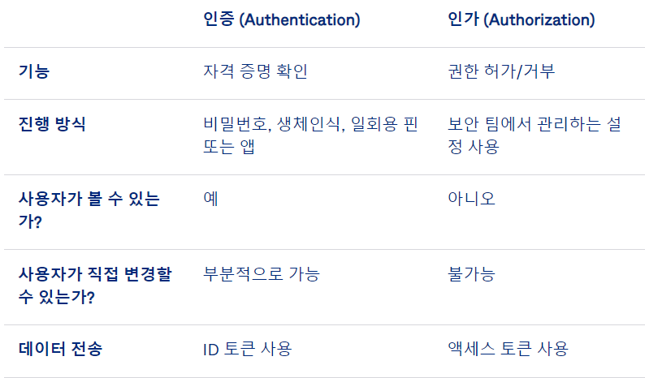
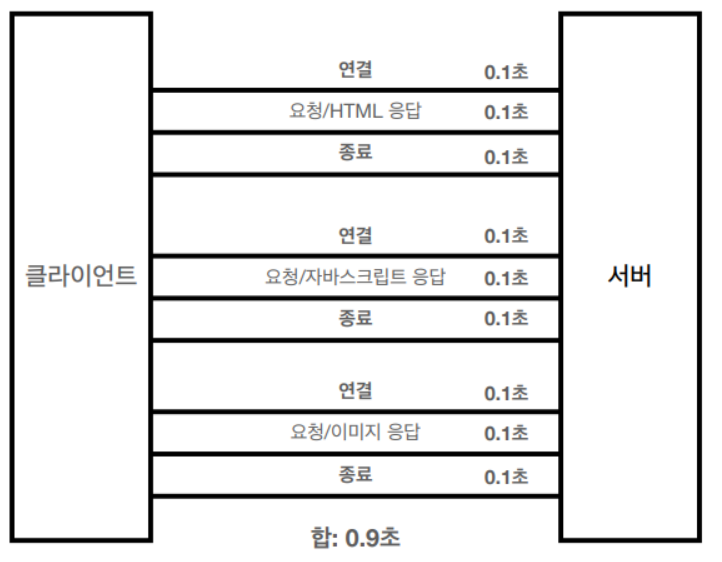
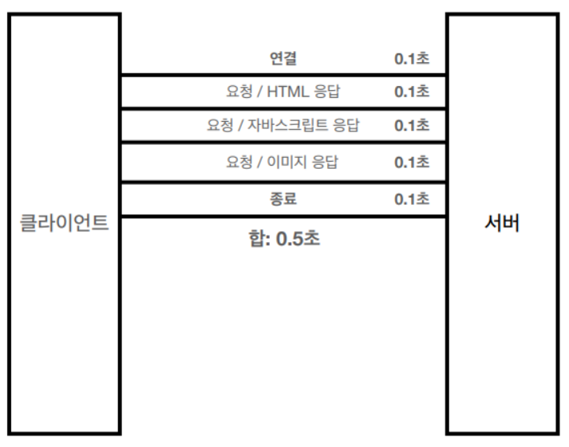
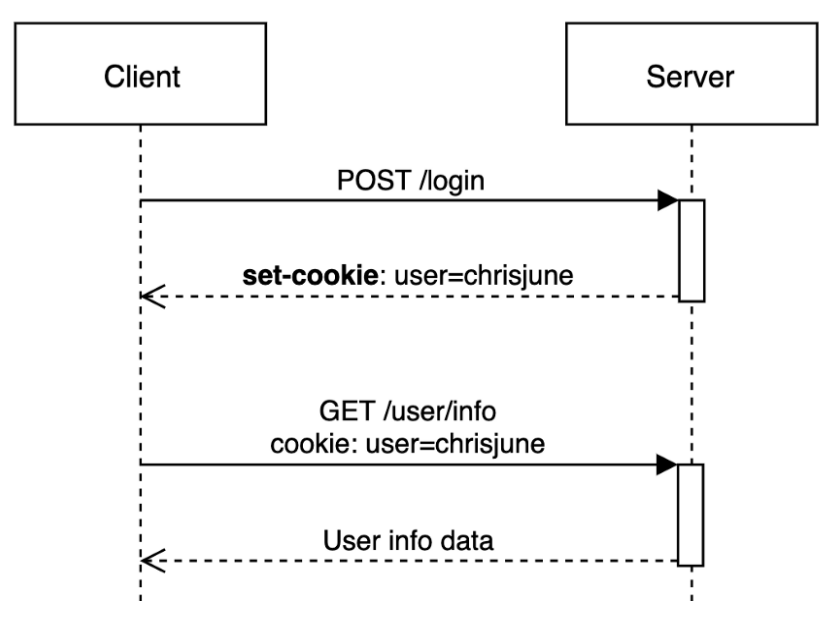
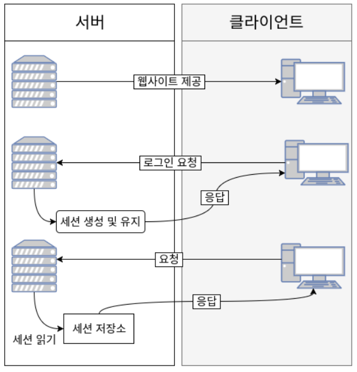
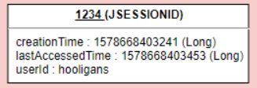
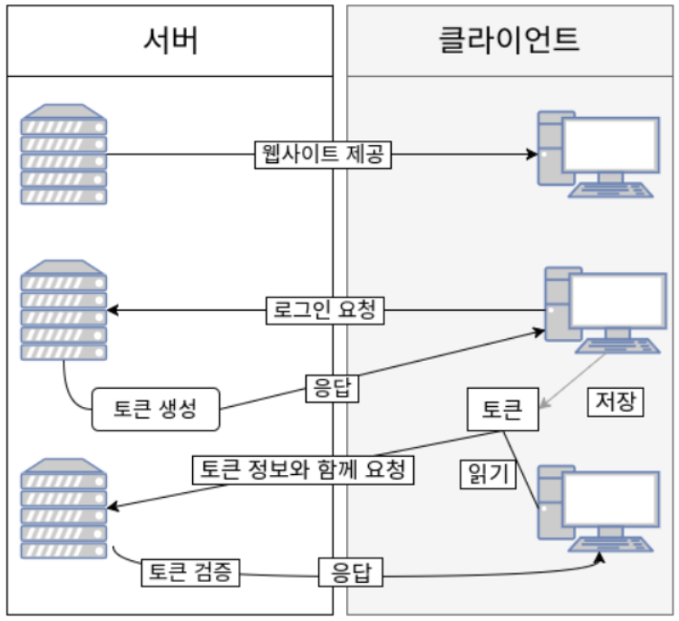

# 인증 및 인가

`인증` 단계에서는 사용자의 신원 확인  
`인가` 및 권한 부여 단계에서는 신원 확인이 된 사용자에게 리소스 액세스 권한 부여  
인증에서 인가로는 이어지지만, 인가에서 인증으로 이어지지는 않음

ex) 콘서트 티켓을 생각해보자

## 인증 (Authentication)

- <b>신원을 확인</b>하는 과정
- 예시
  - 비밀번호
  - PIN : 단일 세션이나 트랜잭션에 한해 액세스 허용
  - 인증 앱 : 액세스를 허용하는 외부 기관을 통해 보안 코드 생성
  - 생체 인식
- 경우에 따라, 다중 요소 인증 방식(<b>`MFA`</b> : Multi-factor Authentication)이 필요한 경우도 존재

## 인가 (Authorization)

- 사용자에게 특정 리소스나 기능에 액세스할 수 있는 <b>권한을 부여</b>하는 프로세스
- 보안 환경에서는 항상 인증 이후에 진행 되어야 함
- 인가 가공물(토큰)로 유저나 디바이스 신원 파악은 유용하지 않음

   

  

   

# 로그인 방식

## HTTP (Hypertext Transfer Protocol)

### 비연결성(Connectionless)

- 요청과 응답을 한번 주고받으면 바로 연결을 끊어버림
- 다음 요청을 위해선 다시 연결
- 서버의 자원을 효율적으로 관리 및 수많은 클라이언트의 요청에 대응 가능
- 문제점 : TCP 3 way handshake 매번 발생
  - 이전에는 각각의 자원에 대해 연결/응답/종료를 반복
  - `HTTP 지속 연결`(Persistent Connections)로 해결
  - 소켓 연결을 일정 시간 더 유지함으로써, 필요한 자원들을 모두 다운받을때까지 연결이 종료되지 않고 연결 요청/응답 반복

| 지속 연결 이전                               | 지속 연결                                               |
| -------------------------------------------- | ------------------------------------------------------- |
|  |  |

### 비상태성(Stateless)

- 요청과 응답을 교환하는 동안 상태를 저장하지 않음
- 서버가 클라이언트의 요청을 저장하지 않음 -> 인가 과정 어떻게 ???

## 쿠키 인증

### 프로세스

1. 브라우저(클라이언트)가 서버에 요청을 보냄
2. 서버는 클라이언트 요청에 대한 응답을 작성할 때, 클라이언트 측에 저장하고 싶은 정보를 응답 헤더의 set-cookie에 담는다
3. 해당 클라이언트는 요청을 보낼때마다, 브라우저에 저장된 쿠키를 요청 헤더의 Cookie에 담아 보냄
4. 서버는 쿠키에 담긴 정보를 바탕으로 클라이언트 식별

### 단점

- 요청 시, 쿠키에 저장된 값을 그대로 보내기 때문에 <b>보안에 취약</b>
- 쿠키에는 <b>용량 제한</b>이 존재
  - 용량 : 4kb
  - 개수 : 사이트 당 20개
- 웹 브라우저마다 제공하는 쿠키가 다르기 때문에, 브라우저간 공유 불가능
- 쿠키 사이즈가 커질수록 네트워크 부하가 심해짐

## 세션 인증

- 쿠키와 달리, 클라이언트의 민감한 정보를 서버측에 저장 및 관리

### 프로세스

1. 로그인 시, 세션이 `서버` 메모리 상에 저장됨 (세션을 식별하기 위한 Session ID 기준으로 저장)
2. 서버에서 브라우저 `쿠키`에 Session ID 저장
3. 클라이언트는 Session ID가 담긴 쿠키를 모든 요청에 포함시켜 전송
4. 서버는 클라이언트가 보낸 Session ID와 서버 메모리로 관리하고 있는 Session ID와 비교

 

> 서버에 저장되는 `세션 객체`  
> Key(Session ID) - Value(속성들)  
> 

### 단점

- 민감한 정보는 없지만, Session ID를 탈취하여 클라이언트인 척 위장할 수 있음
- 서버에서 세션 저장소를 사용하므로, 요청이 많아지면 서버에 부하가 심해짐

## 토큰 인증 방식

- 클라이언트가 인증 되었다는 의미로 `토큰` 부여
- 토큰은 유일하며, 클라이언트는 발급받은 토큰을 서버에 요청을 보낼 때 요청 헤더에 토큰을 심어서 보냄
- 토큰은 클라이언트의 로컬스토리지 혹은 쿠키에 저장됨

### 프로세스

1. 로그인 시, 서버는 클라이언트에게 유일한 토큰 발급
2. 클라이언트는 전달받은 토큰을 `쿠키`나 `로컬스토리지`에 저장하고, 요청할 때마다 `HTTP 요청 헤더`에 포함시켜 전달
3. 서버는 전달받은 토큰을 검증하고, 요청에 응답

### 단점

- <b>토큰 자체의 데이터가 길어</b>, 인증 요청이 많아질수록 네트워크 부하가 심해질 수 있음
- payload 자체는 <b>암호화되지 않음</b>
- 토큰을 탈취 당할 경우, 대처가 어려움 (만료 기한 설정으로 어느정도 해소 가능)

 

# :question: 예상 질문

인증과 인가의 차이점에 대해 설명해보세요

 
인증은 신원을 확인하는 과정이고, 인가는 권한을 부여하는 과정입니다.
주민등록증은 인증과 인가가 가능하지만, 콘서트 티켓의 경우 인가만 가능한 것으로 인증에서 인가로는 이어지지만, 인가에서 인증으로는 이어지지 않습니다.

 

토큰 인증 과정에 대해 설명해보세요

 

 

# :newspaper: Reference

[인증 및 인가](https://dextto.tistory.com/234)  
[인증 및 인가 - okta](https://www.okta.com/kr/identity-101/authentication-vs-authorization/)  
[HTTP 비연결성, 비상태성](https://inpa.tistory.com/entry/HTTP-%F0%9F%8C%90-%EB%B0%B1%EC%97%94%EB%93%9C-%EB%A1%9C%EB%93%9C%EB%A7%B5-HTTP%EB%8A%94-%EB%AC%B4%EC%97%87%EC%9D%BC%EA%B9%8C%EC%9A%94)  
[cookie, session, 토큰 기반 인증](https://inpa.tistory.com/entry/WEB-%F0%9F%93%9A-JWTjson-web-token-%EB%9E%80-%F0%9F%92%AF-%EC%A0%95%EB%A6%AC)
[세션인증 vs 토큰인증](https://velog.io/@chickenrun/%EC%84%B8%EC%85%98-%EC%9D%B8%EC%A6%9D-%EB%B0%A9%EC%8B%9D-VS-Token-%EC%9D%B8%EC%A6%9D%EB%B0%A9%EC%8B%9D%EC%9D%B8%EC%A6%9D%EA%B3%BC-%EC%9D%B8%EA%B0%80)

 
