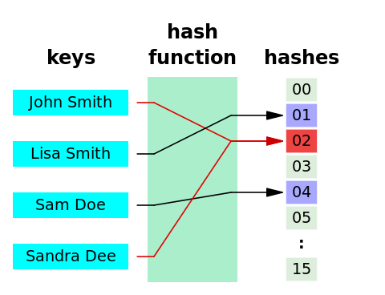
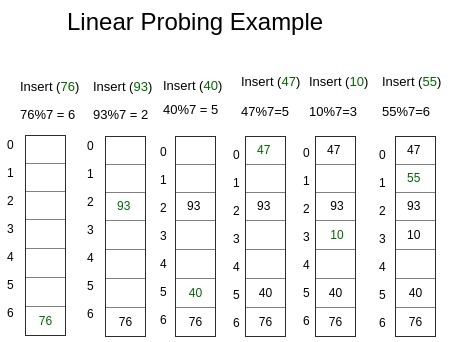

# 💥 Hash Collision

## 목차

[❓ hash 함수](#❓-hash-함수)

[❓ 해시 충돌](#메모리-모델)

[👍 해결 방법](#해결-방법)

[예상 질문](#⁉-예상-질문)

[Reference](#📋-reference)

---

## ❓ Hash 함수?

해시 함수는 임의의 값을 고정된 길이의 해시 값으로 출력하는 함수

## ❓ Hash 충돌

해시 테이블의 두 데이터 조각이 동일한 해시 값을 공유하는 경우 발생

## ❕ 해시 충돌의 원인

1. 해시 함수의 한계

- 다양한 입력값 -> 고정된 크기의 해시 코드로 변함
- 한정된 해시코드로 인해 무한한 수의 입력값이 존재할 수 있으므로 동일한 해시 코드가 생성될 수 있음

2. 해시 테이블의 크기

- 해시 테이블의 크기가 적으면 충돌 가능성 🔺

3. 해시 함수 선택 (분산 정도)

- 해쉬 함수도 여러 종류가 있음
  (MD5,SHA, SHA-1, SHA-256, SHA-512, SHA-3,
  CRC, CRC32 - [10], Tiger, Argon2, Bcrypt, Scrypt, Snefru)
- 해시 함수 종류에 따라 값들의 분산 정도가 나뉨

## 👍 해결 방법

해시값들이 충돌되지 않도록 하는 방법은 크게 Chaining(체이닝), Open Addressing(개방 주소법) 등이 있다.

## ⛓ Chaining

해시 테이블의 구조를 변경해, 각 버킷(해당 값)이 하나 이상의 값을 저장할 수 있도록 함

- 해당 값의 슬롯에 연결된 연결 리스트를 사용해 데이터를 추가

## 🚪 Open Addressing

충돌이 발생하면 비어있는 버킷에 데이터를 저장

### 🚲 선형 탐사

충돌 시 옆자리가 비어있는지 확인하고, 비어 있다면 그 자리에 데이터를 저장

1. 데이터 탐색

- 주어진 데이터 key에 대한 해시 함수 값을 구하고 그 값에 맞는 인덱스에 접근
- key, value 못찾으면 다음 인덱스값 비교 → 반복
- 그래도 찾지 못하면 None 또는 빈 인덱스 리턴

2. 데이터 Create, Update

- key를 통해 탐색
- key값을 찾으면 value update, 못찾으면 새로운 key,value 추가

2. 데이터 삭제

- 1의 과정과 같은 데이터 탐색 후 key값을 찾으면 삭제, 못찾으면 None
- 데이터가 삭제된 인덱스부터 순차적으로 테이블을 돌면서, 삭제된 데이터로 인해 다른 위치에 저장된 다른 값들을 찾고, 해당 값들을 알맞은 위치로 당겨줌
- **이 과정을 제대로 수행하지 않을 경우, 데이터 탐색 과정이 불가능해짐**

### 🚐 제곱 탐사

데이터의 클러스터링을 막기 위해 사용. 클러스터 방지를 위해 index의 제곱을 통해 거리를 벌려줌

- 선형 탐사의 경우, 특정 부위에 몰려 있게 되는 클러스터를 형성할 가능성이 있음
- 충돌 시 제곱수만큼 건너뛴 인덱스(key)에 데이터를 저장

### ➿ 이중 해싱

해시 함수를 2개를 사용해 구한 값들을 연산해 인덱스를 구함...
 

# ⁉ 예상 질문

  
<b>해시 충돌이 나는 이유를 설명하시오.</b>

  

  가변길이를 고정 길이로 변환하는 함수를 해시함수라고 합니다. 고정 길이로 변하는 과정에서 고정 길이의 제한적인 길이로 인해, 이미 저장된 hash와 동일한 hash값이 형성될 수 있고, 이로 인해 충돌이 될 수 있습니다.
  

 

  
<b>해시 충돌을 해결하는 방법 2가지를 설명하시오.</b>

  

  해시 함수의 충돌을 해결하기 위해서는 hash 중복값 처리, 클러스터링의 방지가 중요합니다. 
   
  이를 위해 중복되었을 경우 같은 hash값들을 linkedList로 연결하는 Chaining 방법이 있습니다.
   
  또한, 충돌이 발생할 경우, 다른 비어 있는 곳에 저장하는 Open Addressing 방법이 있으며, 어떻게 분산할 건지에 따라 선형탐사, 제곱 탐사로 나뉩니다.

  

 

# 📋 Reference

- [해시함수 및 해시 충돌](https://en.wikipedia.org/wiki/Hash_function)
- [Open Addressing](https://en.wikipedia.org/wiki/Hash_function)
