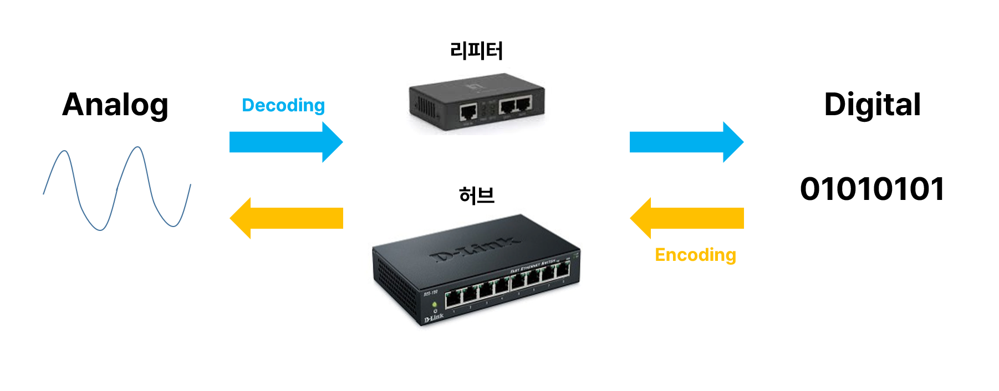

# 네트워크
## 목차 

[네트워크란?](#네트워크란?)

[OSI 7 Layer](#OSI-7-Layer)

[제목 3](#깨끗한-코드)

---

## 네트워크란?
- Network in computer is

  노드와 노드를 연결해 상호작용하는 집합
  - Node is
  컴퓨터, 서버, 네트워킹 하드웨어 등 

## OSI 7 Layer
- OSI (Open System Interconnection model) is

  네트워크들의 통신을 위한 ISO(국제 표준화 기구)의 개념 모델입니다.
  현재는 OSI 7 Layer에서 5,6,7 Layer를 Application Layer로 통합해 TCP/IP 를 사용합니다.

### L1, Physical

- 물리적 매체를 통한 비트 스트림 전송 및 수신
- PDU(Protocol Data Unit): bit
- 허브 : 단순한 중계기 역할, 노드들을 한 곳으로 모으는 역할
- 리피터 : 신호를 증폭시키는 역할
- 

### L2, Data Link

- 물리 계층으로 연결된 두 노드 간 데이터 프레임 전송

- PDU(Protocol Data Unit) : Frame

- 네트워크 계층으로 받은 데이터에 Frame header 또는 trailer를 추가

  이유
  
  - 기기간 논리적 전송로를 정하는 방법 규정
  - 네트워크 토폴로지를 관리하고 최적화하는데 도움됨

    토폴로지: 컴퓨터 네트워크의 요소들(링크, 노드 등)을 물리적으로 연결해 놓은 것, 또는 그 연결 방식
  

- 스위치: MAC 주소를 가진 장비가 연결된 포트로만 프레임을 전송함
- 오류 제어(오류 버림), 재전송, 흐름제어 

### L3, Network
- 주소 지정, 라우트 및 트래픽 제어를 포함한 다중 노드 네트워크 구성 및 관리

- PDU(Protocol Data Unit) : Packet

- 전송계층에서 받은 정보를 분할하고, 헤더를 추가해 패킷을 생성

### L4, Transport
- 분할, 승인 및 다중화를 포함하여 네트워크의 지점 간에 데이터 세그먼트를 안정적으로 전송합니다.

- PDU(Protocol Data Unit) : Segment

- TCP(Transmission Control Protocol) : 높은 신뢰성, 속도 느림

- UDP : 낮은 신뢰성, 속도 빠름

### L5, Session
- 통신 세션 관리

- 통신 세션을 구성하고 상호 작용과 동기화 제공

### L6, Presentation
- 데이터 형식 정의

- 네트워킹 서비스와 어플리케이션 간의 데이터 변환 문자 인코딩, 데이터 압축, 암호화/복호화 포함

- 프로토콜 : png, jpg 등

### L7, Application
- 리소스 공유 또는 원격 파일 액세스와 같은 고급 프로토콜, HTTP, Telnet

- 프로토콜 : HTTP, SMTP, FTP 등

## TCP/IP
### 1. TCP/IP
TCP/IP는 컴퓨터 사이의 통신 표준 및 네트워크의 라우팅 및 상호연결에 대한 자세한 규칙을 지정하는 프로토콜 스위트입니다.

OSI 7계층과 유사하며, 세션, 프레젠테이션, 어플리케이션 계층이 어플리케이션 계층으로 통합되어서 사용된다.

### 2. flow 

---
# 면접 질문

## 1. OSI와 TCP/IP의 차이가 뭐죠?

OSI의 5, 6, 7, 레이어의 코스트와 불필요함으로 TCP/IP를 사용하고 있습니다.

## 2. TCP와 UDP의 차이가 뭐죠? 

### 1-1. TCP
인터넷상에서 데이터를 메세지의 형태로 보내기 위해 IP와 함께 사용하는 프로토콜

### 1-2. TCP의 특징
송수신을 위해 사용되기 때문에 
높은 신뢰성을 보장하지만, 속도가 느리다.

### 1-3. TCP 예시 
웹 프라우징, 이메일 전송, 파일 전송 등

### 2-1. UDP
데이터를 데이터그램 단위로 처리하는 프로토콜

### 2-2. UDP의 특징
정보를 받을 때 송수신 유무 신호 절차를 거치지 않아 헤더 정보가 적음. 그래서 속도가 빠르다.

### 2-3. UDP 예시
실시간 음성 통화, 스트리밍 미디어 등

## 3. 왜 레이어로 나누는 거죠?
유지/개발/보수의 용이를 위함입니다.

독립적인 계층으로 구분하면, 문제의 파악이 용이하며, 보수와 개발에 수월하기 때문입니다.